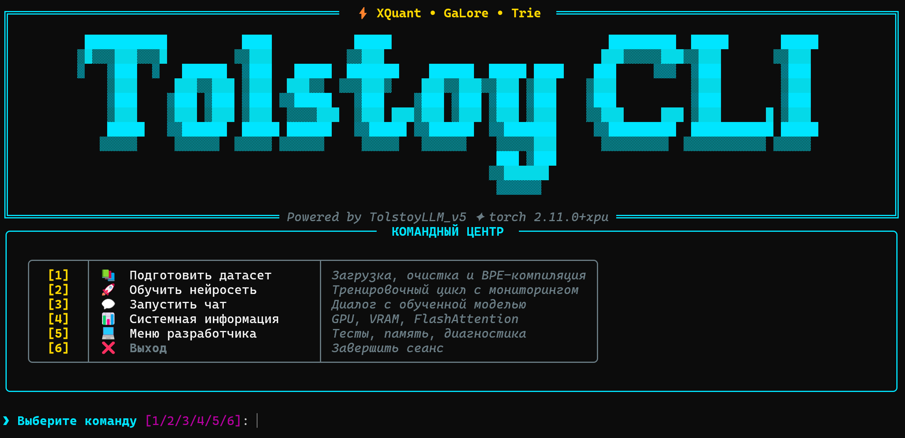

<div align="center">

# 🧠 Tolstoy AI Studio (v7 Pro)

**Ультимативный фреймворк для обучения и инференса русскоязычных LLM на потребительском железе**

[](https://python.org)
[](https://pytorch.org)
[](https://developer.nvidia.com/cuda-toolkit)
[](LICENSE)
<div align="center">
  
</div>

[**Документация**](#-документация) | [**Возможности**](#-ключевые-возможности) | [**Быстрый старт**](#-быстрый-старт) | [**Архитектура**](#-архитектура-v5)

</div>

---

## 🚀 Что такое Tolstoy AI Studio?

**Tolstoy AI Studio** — это исследовательская лаборатория и фреймворк "всё-в-одном", позволяющий создавать современные языковые модели (LLM) с нуля. Проект ориентирован на максимальную эффективность: мы внедряем SOTA-технологии (State-of-the-Art) так, чтобы они работали на вашей домашней видеокарте.

> **Главная цель:** Демократизация обучения LLM для русского языка. Обучайте модели уровня 1B+ параметров на одной RTX 3060/4060.

---

## 🔥 Ключевые возможности v7 Pro

### ⚡ Экстремальные оптимизации
- **GaLore (Gradient Low-Rank Projection):** Обучение больших весов через проекции в низкий ранг. Экономия до **80% VRAM** состояний оптимизатора.
- **Muon Optimizer:** Новый стандарт стабильности. Поддерживает ортогональность весов через итерации Ньютона-Шульца, ускоряя сходимость.
- **XQuant-CL (INT8 KV-Cache):** Динамическое квантование ключей и значений. Позволяет работать с контекстом в 4 раза длиннее без переполнения памяти.
- **Speculative Decoding (MTP):** Ускорение генерации в **2-3 раза** за счет каскада спекулятивных голов, предсказывающих токены наперед.

### 🛠️ Продвинутый CLI Интерфейс
- **Умный импорт:** Поддержка `.txt`, `.md`, `.json`, `.csv`, `.xml`, `.pdf`, `.docx`.
- **Интеграция Corus:** Мгновенный доступ к 21+ гигантскому русскому датасету (Wiki, Lenta, Taiga, Habr).
- **Токенизатор v10:** Сверхбыстрый BPE (Trie + Linked Arrays), оптимизированный под кириллицу.

---

## 🏗️ Архитектура v5 (SOTA)

Модель построена на базе **TolstoyLLM_v5** и включает:
- **GQA (Grouped Query Attention):** Оптимальное соотношение качества и скорости.
- **RoPE + YaRN:** Продвинутое позиционное кодирование с поддержкой экстраполяции контекста.
- **Sparse MoE (Mixture of Experts):** Использование "Смеси экспертов" (8 экспертов, 2 активных) для масштабирования знаний без замедления инференса.
- **QK-Norm:** Дополнительная нормализация внутри Attention для предотвращения взрыва градиентов.

---

## 📚 Документация

Мы подготовили исчерпывающие руководства по каждому компоненту:

### 🛠️ Основные руководства
| Документ | Содержание |
| :--- | :--- |
| 📖 [**CLI Guide**](docs/cli_guide.md) | Полное руководство по интерфейсу, пресетам и командам. |
| 📐 [**Architecture**](docs/architecture.md) | Глубокий технический разбор модели и математики. |
| 🧠 [**Tokenizer Deep Dive**](docs/tokenizer_deep_dive.md) | Как работает наш BPE и почему он такой быстрый. |
| 🏋️ [**Training Guide**](docs/training.md) | Всё об оптимизаторах, GaLore и процессе обучения. |

### 🎓 Обучающие туториалы (Tutorials)
1. 📂 [**Сбор правильного датасета**](docs/tutorials/1_dataset_creation.md) — Как подобрать данные под ваше железо.
2. ⚙️ [**Руководство по обучению**](docs/tutorials/2_training_guide.md) — Выбор пресетов и магия оптимизаций (GaLore, 8-bit).
3. ✂️ [**Токенизация и Vocab Size**](docs/tutorials/3_tokenization_guide.md) — Золотая формула размера словаря.
4. 💬 [**Взаимодействие с моделью**](docs/tutorials/4_model_interaction.md) — Температура, штрафы и искусство промптинга.

---

## 🚀 Быстрый старт

1. **Клонируйте репозиторий и установите зависимости:**
   ```bash
   git clone https://github.com/zzzigrok/tolstoy-cli.git
   cd tolstoy-cli
   pip install -r requirements.txt
   ```

2. **Запустите интерактивный CLI:**
   ```bash
   python tolstoy_cli.py
   ```

3. **Следуйте шагам:**
   - **[1] 🛠️ Подготовить датасет** — соберите текст и обучите токенизатор.
   - **[2] 🚀 Обучить нейросеть** — выберите пресет (например, `mini`) и включите GaLore.
   - **[3] 💬 Запустить чат-интерфейс** — общайтесь со своей моделью!

---

## 📊 Пресеты моделей

| Пресет | Параметры (примерно) | Реком. VRAM | Назначение |
| :--- | :--- | :--- | :--- |
| **Nano / Mini** | 5M - 25M | 1-2 GB | Тесты на CPU / Слабые GPU |
| **Small / Chat** | 80M - 150M | 4-8 GB | Базовые диалоговые модели |
| **Medium / Large** | 350M - 1B | 12-16 GB | Продвинутые модели для RTX 3090/4080 |
| **XLarge** | 3B+ | 24 GB+ | Экстремальный масштаб (4090 / A100) |

---

## 🤝 Вклад в развитие

Проект находится в активной разработке. Мы приветствуем Pull Requests, направленные на:
- Добавление новых датасетов в Corus-интеграцию.
- Оптимизацию CUDA-кернелов для Sparse MoE.
- Улучшение алгоритмов квантования.

---

<div align="center">

**Сделано с ❤️ для развития Русского NLP и Open Source сообщества.**

*[⬆ Наверх](#-tolstoy-ai-studio-v7-pro)*

</div>
