# Tolstoy AI Studio: Архитектура и Модели (Глубокое погружение)

Этот документ представляет собой подробный технический разбор **TolstoyLLM_v5**. Мы объединили аналогии для новичков, строгую математику и архитектурные диаграммы, чтобы объяснить, как достигается высокая эффективность модели.

---

## 🏗️ Общая топология модели

Модель построена на базе архитектуры Transformer (decoder-only) с современными оптимизациями. Основная цель v5 — достижение максимального качества на русском языке при минимальном потреблении видеопамяти (VRAM).

### Схема "Блока Толстого" (Transformer Layer)
В отличие от классического трансформера, мы используем **Pre-Norm** структуру и **Parallel Residuals**.

```mermaid
graph TD
    Input["Входные токены [B, T]"] --> Emb["Эмбеддинги (Weight Tying)"]
    Emb --> Drop["Residual Dropout"]
    
    subgraph "Слои Трансформера (x N)"
        direction TB
        L_In["Вход в слой"] --> Norm1["RMSNorm (Pre-Norm)"]
        Norm1 --> Attn["GQA + RoPE Attention"]
        Attn --> Add1["Residual Connection (Сложение)"]
        
        Add1 --> Norm2["RMSNorm"]
        Norm2 --> FFN["Sparse MoE / SwiGLU FFN"]
        FFN --> Add2["Residual Connection (Сложение)"]
        Add2 --> L_Out["Выход из слоя"]
    end
    
    Drop --> L_In
    L_Out --> FinalNorm["Финальный RMSNorm"]
    FinalNorm --> Head["Выходная проекция (Shared Weights)"]
    Head --> Logits["Логиты [B, T, V]"]

    style L_In fill:#1a1a2e,stroke:#ff2a6d,stroke-width:2px
    style FFN fill:#0d2818,stroke:#01ffc3
    style Attn fill:#0d2818,stroke:#01ffc3
```

---

## 🧩 Ключевые компоненты архитектуры (Детали реализации)

### 1. RMSNorm (Root Mean Square Layer Normalization)
**Подробный разбор:** [docs/subdocs/rmsnorm.md](subdocs/rmsnorm.md)

**Зачем это нужно:** Стабилизация сигналов. Обычный LayerNorm центрирует данные (вычитает среднее), что требует лишних проходов по памяти. RMSNorm пропускает этот этап, масштабируя вектор на основе его среднеквадратичной мощности.

**Реализация в коде (`models/layers.py`):** 
Мы строго контролируем точность вычислений. В коде используется принудительное приведение к Float32:
`x_f32 = x.float()`
Затем вычисляется `norm = x_f32.pow(2).mean(-1, keepdim=True)`, умножается на `weight.float()` и только после этого конвертируется обратно в FP16/BF16 (`output_f32.type_as(x)`).
Это предотвращает переполнение дисперсии (NaN-stability) при возведении больших чисел в квадрат.

**Важная архитектурная деталь:** RMSNorm также применяется **дополнительно** внутри механизма внимания (Attention) к проекциям `Query` и `Key` (`self.q_norm` и `self.k_norm`) до применения RoPE. Это новейшая практика, называемая QK-Norm, которая предотвращает взрыв логитов внимания.

---

### 2. RoPE (Rotary Positional Embeddings) + YaRN
**Подробный разбор:** [docs/subdocs/rope.md](subdocs/rope.md)

**Как это работает:** Вместо добавления фиксированных чисел к эмбеддингам, RoPE применяет матрицу вращения. 
- **YaRN (Yet another RoPE extension):** Технология динамической экстраполяции. 
В функции `precompute_freqs_cis` реализован механизм `rope_scaling`. При масштабировании (scaling > 1.0) мы используем NTK-Aware Scaling: базовая частота `theta` пересчитывается: `theta = theta * (rope_scaling ** (dim / (dim - 2)))`. Мы также применяем маску `low_freq_mask` для корректной интерполяции частот.

---

### 3. GQA (Grouped Query Attention)
**Подробный разбор:** [docs/subdocs/gqa.md](subdocs/gqa.md)

**Экономия KV-кэша:** В стандартном MHA на каждую голову запроса (Query) приходится своя голова ключа (Key) и значения (Value). В GQA мы группируем запросы. 
- **Конфигурация v5:** По умолчанию используется разделение `n_kv_head = max(1, n_head // 4)`, то есть на 4 головы Query приходится 1 голова Key/Value.
- В модуле `MultiheadSelfAttention` ключи и значения повторяются (repeat_interleave) `n_rep` раз перед передачей в `F.scaled_dot_product_attention`, что позволяет использовать оптимизированный FlashAttention из PyTorch (SDPA).

---

### 4. Sparse MoE (Mixture of Experts) + SwiGLU
**Подробный разбор:** [docs/subdocs/moe.md](subdocs/moe.md) и [docs/subdocs/swiglu.md](subdocs/swiglu.md)

Вместо тяжелого полносвязного слоя мы используем "Смесь экспертов".
- **Маршрутизатор (Router):** По умолчанию в `TolstoyLLM_v5` используется 8 экспертов (`num_experts=8`), из которых для каждого токена выбираются 2 лучших (`top_k=2`).
- **Векторизованная маршрутизация:** В `SparseMoE.forward` мы используем эффективную логику маскирования (без циклов по токенам), что радикально ускоряет инференс.
- **SwiGLU Активация:** В `FeedForward` используется скрытая размерность `int(8 * dim / 3)`, которая затем округляется до ближайшего кратного 256 для выравнивания в памяти GPU (`256 * ((hidden_dim + 255) // 256)`).
- **Load Balancing:** Модуль автоматически вычисляет `load_balancing_loss` во время обучения: `num_experts * torch.sum(f_i * P_i)`. Этот лосс возвращается из каждого блока и суммируется в общий `total_aux_loss` для стабилизации маршрутизации.

---

### 5. Weight Tying (Связанные веса)
Мы используем общую матрицу для входных эмбеддингов (`self.tok_embeddings.weight`) и выходной проекции (`self.output.weight`).
- **Особенность обучения:** В функции `configure_optimizers` мы реализовали защиту от дублирования параметров в оптимайзере: параметры фильтруются по уникальным ключам, чтобы связанные веса не получали двойное обновление градиентов.

---

## ⚡ Оптимизации инференса и памяти

### XQuant-CL (Extreme Quantization)
**Подробный разбор:** [docs/subdocs/xquant.md](subdocs/xquant.md)
Система динамического квантования KV-кэша. В классе `XQuantCache` реализовано сжатие в **INT8** (`mode='int8kv'`).
Ключи (Keys) квантуются *per-channel* (по каналу: `t.abs().amax(dim=-1)`), а Значения (Values) квантуются *per-tensor*. Скейлы (scales) сохраняются в родном формате модели (FP16/BF16), а данные хранятся как `torch.int8`.

### Speculative Decoding (MTP)
**Подробный разбор:** [docs/subdocs/speculative.md](subdocs/speculative.md)
Реализован специальный модуль `SpeculativeHead`, который представляет собой каскад дополнительных голов (`num_stages=3`). Каждая "спекулятивная" голова предсказывает токены на шаг вперед. В `TolstoyLLM_v5` это интегрировано в архитектуру через флаг `use_speculative`.

---

## 🏋️ Оптимизации обучения (Muon & GaLore)

### Muon: Костоправ для весов
Вместо стандартного AdamW для больших матриц мы используем **Muon**. Он применяет итерации Ньютона-Шульца для поддержания **ортогональности** весов. Это предотвращает "схлопывание" градиентов и позволяет модели учиться гораздо быстрее и стабильнее.

### GaLore: Обучение в низком ранге
Позволяет обновлять веса через проекцию в низкоранговое пространство. Благодаря этому, состояния оптимизатора (моментум и др.) занимают в 10 раз меньше места, что критично для обучения 7B+ моделей на одной RTX 3090/4090.

---

## ❓ FAQ (Часто задаваемые вопросы)

**В: Почему SwiGLU лучше обычного ReLU?**
О: SwiGLU не имеет "мертвых зон" (как ReLU при отрицательных значениях) и плавно активируется, что позволяет градиентам течь свободнее, улучшая обучение глубоких сетей.

**В: Как GQA влияет на качество ответов?**
О: Практические тесты показывают, что потеря качества при переходе от MHA к GQA составляет менее 1%, в то время как экономия памяти достигает 3-4 раз. Это лучший компромисс для локальных моделей.

**В: Зачем нужны Pre-Norm и Residual Connections?**
О: Pre-Norm (нормализация перед блоком) делает обучение стабильным "из коробки" без сложного подбора скорости обучения. Residual Connections (сложение входа и выхода) позволяют сигналу проходить сквозь 30+ слоев, не затухая.

**В: Зачем применяется RMSNorm к Q и K?**
О: QK-Norm предотвращает ситуацию, когда скалярное произведение Q и K достигает экстремально больших значений, что делает Attention-матрицу слишком резкой (близкой к one-hot вектору).

**В: Можно ли отключить MoE и использовать обычную модель?**
О: Да, в конфигурации можно установить `num_experts=1`, тогда модель превратится в классическую "плотную" (dense) сеть. Однако MoE-версия обычно эффективнее при том же бюджете вычислений.