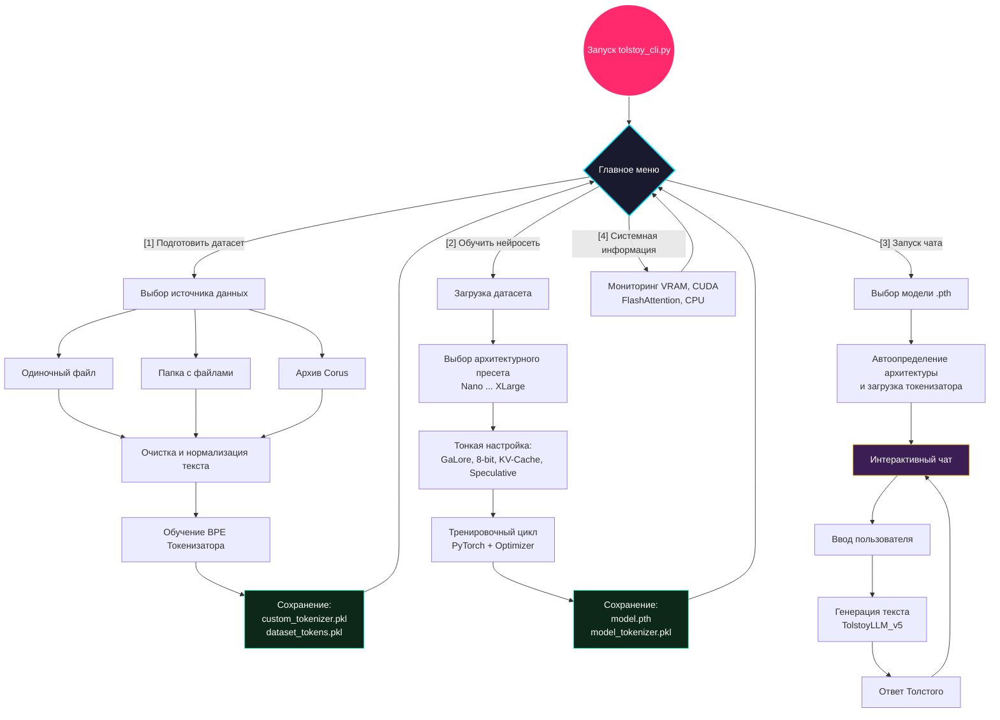

# Tolstoy AI Studio: Руководство пользователя (Полноценный мануал)

Скрипт `tolstoy_cli.py` — это центр управления вашей персональной нейросетью. Этот мануал поможет вам пройти путь от "сырого текста" до "умного чат-бота".

---

## 🏁 Подготовка окружения

Перед запуском убедитесь, что у вас установлены все зависимости:
```bash
pip install -r requirements.txt
```
Для работы на GPU NVIDIA рекомендуется установить `bitsandbytes` для использования 8-битных оптимизаторов.

---

## 🗺️ Общая архитектура рабочего процесса

Ниже представлена визуальная блок-схема, описывающая полный цикл работы с Tolstoy AI Studio:



---

## 🛠️ Этап 1: Подготовка данных (Меню [1])

Ваша модель будет настолько умной, насколько качественные данные вы ей дадите.

### 1.1. Выбор источника данных
В меню подготовки датасета доступно три пути:
- **[1] Одиночный файл:** Поддержка форматов `.txt`, `.md`, `.json`, `.csv`, `.xml`, а также (при наличии соответствующих библиотек) `.pdf` и `.docx`.
- **[2] Папка с файлами:** Скрипт рекурсивно обойдет папку, найдет все поддерживаемые форматы и объединит их в единый текстовый корпус.
- **[3] Архив датасета через Corus:** (Требует `pip install corus`). Позволяет в один клик скачать и распаковать огромные датасеты. Доступен 21 вариант, включая:
  - **Lenta.ru / Lenta.ru v2** (Новости)
  - **Wikipedia (ru)** (Энциклопедические знания)
  - **Коллекция Taiga** (Fontanka, Social, Proza, Stihi, Subtitles, Magazines, Arzamas, Habr и др.)
  - **Pikabu / Habr / Buriy Webhose**

*Примечание:* Во время извлечения текстов работает автоматическая очистка от шума и нормализация текста.

### 1.2. Обучение токенизатора
**Подробности:** [docs/tokenizer_deep_dive.md](../tokenizer_deep_dive.md)
После сбора текста CLI обучит BPE-токенизатор. 
- **Размер словаря (`vocab_size`):** Скрипт автоматически предложит оптимальный размер (от 1024 для микро-текстов до 8192+ для больших корпусов).
- **Метрики качества:** По завершении вы можете посмотреть показатели токенизатора, такие как *Фертильность* (токенов на слово) и *Коэффициент сжатия* (байт на токен).
- **Результат:** Будут созданы файлы `custom_tokenizer.pkl` (глобальный токенизатор) и `dataset_tokens.pkl` (векторизованный текст для обучения).

---

## 🚀 Этап 2: Обучение (Pre-training) (Меню [2])

### 2.1. Выбор пресета
Доступно 8 пресетов конфигурации архитектуры:
- **nano:** Ультра-легкая сеть. Для быстрых экспериментов на любых устройствах.
- **mini:** Ультра-легкая сеть. Идеальна для быстрых тестов на CPU.
- **small:** Базовая модель. Хороший баланс для быстрого обучения на GPU.
- **chat:** Модель с увеличенным окном контекста. Отлично подходит для диалогов.
- **logic:** Глубокая архитектура (больше слоев). Для сложных логических связей.
- **medium:** Продвинутая тяжелая модель. Требует мощной видеокарты (VRAM 8GB+).
- **large:** Максимальное качество. Требует VRAM 16GB+ и мощного GPU.
- **xlarge:** Экстремальный масштаб. Только для GPU 24GB+ (RTX 4090, A100).

### 2.2. Тонкая настройка (Оптимизации)
Перед стартом вы можете включить продвинутые механизмы:
- **GaLore:** Экономит до 82.5% VRAM оптимизатора, позволяя обучать большие модели на обычных видеокартах.
- **8-bit AdamW:** Альтернативный метод экономии памяти (если GaLore выключен).
- **Speculative Heads:** Добавляет спекулятивные головы (для будущего ускорения генерации в чате).
- **KV-Cache Mode:** Выбор формата хранения внимания: `int8kv`, `xquant` или `full`.

*Скрипт автоматически создаст привязанную к модели копию токенизатора (например, `model_name_tokenizer.pkl`).*

---

## 💬 Этап 3: Чат и взаимодействие (Меню [3])

### 3.1. Загрузка модели
Система автоматически:
1. Попытается загрузить "родной" токенизатор модели (с суффиксом `_tokenizer.pkl`), а при его отсутствии возьмет глобальный `custom_tokenizer.pkl`.
2. Просканирует веса (`.pth`) и определит архитектуру (число слоев, эмбеддинг, экспертов MoE, наличие спекулятивных голов).

### 3.2. Параметры генерации
Базовые настройки в v7:
- **Temperature:** `0.4` (Сбалансированная, не слишком случайная генерация).
- **Top-P:** `0.9`.
- **Repetition Penalty:** `2.0` (Агрессивная защита от зацикливания и повторений).
- **Speculative Decoding:** Если модель обучалась со спекулятивными головами, вы сможете включить это для значительного ускорения вывода.

---

## ℹ️ Этап 4: Системная информация (Меню [4])

Встроенный системный монитор отображает:
- Версию PyTorch.
- Статус доступности CUDA и название GPU.
- Поддержку FlashAttention (ускоряет инференс).
- Поддержку JIT-компиляции (`torch.compile`).
- Доступную и используемую оперативную (RAM) и видеопамять (VRAM).
- Количество задействованных потоков CPU.

---

## 🛠️ Траблшутинг (Решение проблем)

### Проблема: `RuntimeError: CUDA out of memory`
**Решение:** 
1. Убедитесь, что включили **GaLore** или **8-bit AdamW**.
2. Выберите пресет поменьше (`small` вместо `medium`).
3. Если ошибка при инференсе — проверьте режим KV-кэша.

### Проблема: Модель несет бред (Галлюцинации)
**Решение:** 
1. Увеличьте объем данных для обучения.
2. Проверьте, что используете правильный `_tokenizer.pkl` для конкретной модели.

### Проблема: Ошибка чтения файла датасета
**Решение:** 
Убедитесь, что файл имеет кодировку UTF-8 или CP1251. Для PDF/DOCX убедитесь, что установлены `PyPDF2` и `python-docx`. Для XML/JSON структура должна содержать текстовые поля.
