# Разбор кода: GaLore Optimizer (Gradient Low-Rank Projection)

В этом документе мы разберем оптимизатор **GaLore**, реализованный в `training/trainer.py`. Это прорывная технология, которая позволяет обучать огромные модели (Large Language Models) на обычных видеокартах, экономя колоссальные объемы видеопамяти (VRAM).

---

## 🧠 Идея "на пальцах"

Обучение нейросети — это не просто изменение весов. Современные оптимизаторы (типа AdamW) должны помнить историю изменений для каждого отдельного числа в сети (моментум, дисперсия). 
Если в модели 1 миллиард параметров, то оптимизатору нужно хранить еще 2 миллиарда чисел истории. Это сжирает всю память видеокарты!

**GaLore (Gradient Low-Rank Projection)** работает как умный архиватор. 
Представьте, что вам нужно запомнить огромную таблицу изменений (градиентов) размером 1000x1000 (1 миллион чисел). Вместо того чтобы зубрить каждый пиксель, GaLore замечает в таблице закономерности и сжимает её в две узкие полоски: 1000x64 и 64x1000 (суммарно 128 тысяч чисел). 

Мы сохраняем историю только для этой крошечной сердцевины (64 на 64). Когда приходит время обновить веса, мы распаковываем эту узкую полоску обратно в большую матрицу.
**Результат:** оптимизатор потребляет на 80-90% меньше памяти, а качество обучения остается почти таким же!

---

## 💻 Реализация в коде (training/trainer.py)

Посмотрим на ключевые механизмы класса `GaLoreOptimizer`.

### Шаг 1: "Архивация" градиента (Поиск подпространства)

Раз в `update_proj_gap` шагов (обычно раз в 200 шагов), мы вычисляем матрицы сжатия $U$ и $V$ с помощью **SVD** (Сингулярного разложения).

```python
    def _project_gradient(self, param, grad, rank, update_proj_gap, step):
        state = self.state.get(param, {})

        # Каждые N шагов ищем новые "базовые правила" (матрицы U и V)
        if step % update_proj_gap == 0 or 'U' not in state:
            # SVD раскладывает матрицу на три: U, S, Vh
            # Мы берем только часть (rank) - это и есть сжатие
            U, S, Vh = torch.linalg.svd(grad.float(), full_matrices=False)
            state['U'] = U[:, :rank].to(grad.dtype)
            state['V'] = Vh[:rank, :].T.to(grad.dtype)
            
            # ОПЦИОНАЛЬНО: Дополнительно сжимаем сами матрицы в 8-bit (INT8)
            if self.defaults['quantize_projection']:
                state['U_q'] = self._quantize_lowrank(state['U'])
                state['V_q'] = self._quantize_lowrank(state['V'])

        U_r = state.get('U')
        V_r = state.get('V')

        # Сжимаем огромный градиент в маленькое "ядро" (размера rank x rank)
        grad_proj = U_r.T @ grad @ V_r
        return grad_proj, U_r, V_r, original_shape
```

### Шаг 2: Обучение в "сжатом" виде и распаковка

```python
    @torch.no_grad()
    def step(self, closure=None):
        # ...
        for p in group['params']:
            grad = p.grad.data
            
            # 1. Получаем сжатый градиент (маленький квадрат)
            grad_proj, U_r, V_r, orig_shape = self._project_gradient(...)

            state = self.state.setdefault(p, {})
            # 2. Храним историю (моментум Adam) ТОЛЬКО для сжатого градиента!
            # Именно здесь происходит основная экономия памяти.
            exp_avg = state['exp_avg_proj']
            exp_avg_sq = state['exp_avg_sq_proj']

            # ... классическая математика AdamW над сжатыми данными ...
            update_proj = (exp_avg / denom).mul_(step_size * scale)

            # 3. Распаковка (Projection Back)
            # Возвращаем сжатое обновление обратно к оригинальному размеру весов
            update = U_r @ update_proj @ V_r.T

            # 4. Вычитаем из весов модели
            p.data.add_(update, alpha=-1.0)
```

---

## 📊 Визуализация процесса (Mermaid)

```mermaid
graph TD
    FullGrad["Большой Градиент (Например, 4096 x 4096)"] --> SVD{"SVD (Раз в 200 шагов)"}
    
    SVD -->|Создает| U["Матрица U\n(4096 x 64)"]
    SVD -->|Создает| V["Матрица V\n(64 x 4096)"]
    
    FullGrad --> ProjDown(("Сжатие (U^T * G * V)"))
    U -.-> ProjDown
    V -.-> ProjDown
    
    ProjDown --> LowGrad["Маленький Градиент\n(64 x 64)"]
    
    subgraph "Зона низкого потребления VRAM"
        LowGrad --> Adam["AdamW Математика\n(Хранение Моментума 64x64)"]
    end
    
    Adam --> LowUpdate["Сжатое Обновление\n(64 x 64)"]
    
    LowUpdate --> ProjUp(("Распаковка (U * Update * V^T)"))
    U -.-> ProjUp
    V -.-> ProjUp
    
    ProjUp --> FullUpdate["Итоговое Обновление\n(4096 x 4096)"]
    FullUpdate --> Weights(("Обновление Весов"))
    
    style SVD fill:#ff2a6d,stroke:#000
    style Adam fill:#1a1a2e,stroke:#01ffc3
    style Weights fill:#0d2818,stroke:#01ffc3
```



## 🎯 Поддержка Квантования (Q-GaLore)
В коде реализована функция `quantize_projection`. Если её включить, то даже матрицы `U` и `V` будут храниться в формате 8-bit (INT8). Это позволяет запускать обучение моделей на 7 миллиардов параметров на видеокартах с 24 ГБ памяти, что раньше было физически невозможно без использования десятка GPU!
