# Разбор кода: GQA (Grouped Query Attention)

В этом документе мы разберем реализацию **Группового Внимания (GQA)** внутри класса `MultiheadSelfAttention` (файл `models/layers.py`).

---

## 🧠 Идея "на пальцах"

Механизм внимания — это сердце языковой модели. Он позволяет каждому слову "посмотреть" на все предыдущие слова и понять контекст. 
Для этого используются 3 сущности:
*   **Запрос (Q - Query):** "Что я ищу?" (например, "к какому существительному относится это прилагательное?")
*   **Ключ (K - Key):** "Кто я такой?" (описание слова)
*   **Значение (V - Value):** "Что я значу?" (смысловая нагрузка)

В старых моделях (MHA - Multi-Head Attention) для каждого "Запроса" генерировались свои уникальные "Ключи" и "Значения". Если у вас 32 головы внимания, вам нужно хранить в памяти 32 набора Ключей и Значений. Это пожирало всю видеопамять (VRAM) на длинных текстах.

**GQA (Grouped Query Attention)** решает эту проблему. Мы объединяем Запросы в "группы". Например, 4 головы Запросов используют всего 1 общую голову Ключей и Значений. 
*   Качество ответов модели почти не падает.
*   Потребление памяти (KV-кэша) падает **в 4 раза**.

---

## 💻 Реализация в коде (models/layers.py)

В `TolstoyLLM_v5` GQA встроен на уровне архитектуры:

```python
class MultiheadSelfAttention(nn.Module):
    def __init__(self, n_embd, n_head, n_kv_head=None, use_xquant=False):
        super().__init__()
        self.n_head = n_head
        # Если количество KV-голов не задано, используем 1/4 от обычных голов (GQA)
        self.n_kv_head = n_kv_head if n_kv_head is not None else max(1, n_head // 4)
        
        # Сколько запросов (Q) приходится на один ключ (K)
        self.n_rep = self.n_head // self.n_kv_head
        
        self.head_dim = n_embd // n_head
        
        # Создаем линейные слои
        # Обратите внимание: слой wq (Запросы) БОЛЬШЕ, чем слои wk и wv!
        self.wq = nn.Linear(n_embd, self.n_head * self.head_dim, bias=False)
        self.wk = nn.Linear(n_embd, self.n_kv_head * self.head_dim, bias=False)
        self.wv = nn.Linear(n_embd, self.n_kv_head * self.head_dim, bias=False)
```

### Как это работает во время "прохода" (forward):

```python
        # ... генерация Q, K, V ...
        
        # Дублирование (repeat_interleave) ключей и значений
        # Если у нас 32 Q-головы и 8 K-голов, мы физически "размножаем" 
        # каждую K-голову 4 раза, чтобы PyTorch смог их перемножить.
        if self.n_rep > 1:
            k = k.repeat_interleave(self.n_rep, dim=1)
            v = v.repeat_interleave(self.n_rep, dim=1)

        # Передаем в сверхбыструю функцию PyTorch (FlashAttention)
        y = F.scaled_dot_product_attention(q, k, v, is_causal=is_causal)
```

---

## 📊 Визуализация процесса (Mermaid)

```mermaid
graph TD
    Input["Эмбеддинг токена"] --> WQ["Матрица Wq (32 головы)"]
    Input --> WK["Матрица Wk (8 голов)"]
    Input --> WV["Матрица Wv (8 голов)"]
    
    WQ --> Q["Q: 32 вектора"]
    WK --> K["K: 8 векторов"]
    WV --> V["V: 8 векторов"]
    
    K --> RepK{"Дублирование x4\n(repeat_interleave)"}
    V --> RepV{"Дублирование x4\n(repeat_interleave)"}
    
    RepK --> K_Expanded["K_expanded: 32 вектора"]
    RepV --> V_Expanded["V_expanded: 32 вектора"]
    
    Q --> Attention((Механизм<br>Внимания))
    K_Expanded --> Attention
    V_Expanded --> Attention
    
    Attention --> Output["Результат"]
    
    style WQ fill:#1a1a2e,stroke:#ff2a6d
    style WK fill:#0d2818,stroke:#01ffc3
    style WV fill:#0d2818,stroke:#01ffc3
```



## 🎯 Почему PyTorch не делает это сам?
Функция `F.scaled_dot_product_attention` (SDPA) в новых версиях PyTorch умеет работать с GQA *нативно* (без ручного дублирования `repeat_interleave`), но для этого тензоры должны иметь специальный формат. В нашем коде оставлен `repeat_interleave` как надежный fallback для гарантированной работы на любом железе, но в будущих патчах v5 мы перейдем на чистое SDPA для еще большей скорости.
