# Разбор кода: Sparse MoE (Mixture of Experts)

В этом документе мы разберем реализацию **Sparse Mixture of Experts (Разреженная смесь экспертов)** внутри класса `SparseMoE` (файл `models/layers.py`).

---

## 🧠 Идея "на пальцах"

Представьте себе огромную поликлинику. В старых нейросетях (без MoE) каждый пациент (токен/слово) должен был обойти всех врачей по очереди, даже если ему нужен был только окулист. Это работало, но было невероятно долго и дорого.

В архитектуре **MoE (Mixture of Experts)** поликлиника работает умнее:
1.  Пациент приходит к **Маршрутизатору (Router)** (главному терапевту).
2.  Терапевт решает: "Тебе нужен кардиолог и невролог" (выбирает **Топ-2 экспертов**).
3.  Пациент идет *только* к этим двум врачам. Остальные врачи в это время пьют чай (не расходуют вычислительные ресурсы).

В нашем коде у нас **8 экспертов**. Для каждого слова выбираются только **2**. Это значит, что модель может быть в 4 раза "умнее" (иметь больше параметров), но работать так же быстро, как маленькая модель!

---

## 💻 Реализация в коде (models/layers.py)

В `TolstoyLLM_v5` класс `SparseMoE` заменяет стандартный полносвязный слой (FeedForward).

```python
class SparseMoE(nn.Module):
    def __init__(self, dim, num_experts=8, top_k=2, num_shared_experts=0, ...):
        super().__init__()
        self.num_experts = num_experts
        self.top_k = top_k
        
        # Маршрутизатор: линейный слой, который дает оценку (logit) каждому эксперту
        self.router = nn.Linear(dim, num_experts, bias=False)
        
        # Сами "эксперты" - это просто обычные нейронные слои (FeedForward)
        self.experts = nn.ModuleList([FeedForward(dim) for _ in range(num_experts)])

    def forward(self, x):
        B, T, C = x.shape
        x_flat = x.view(-1, C) # Вытягиваем все токены в один длинный список
        
        # 1. Маршрутизация: оцениваем каждого эксперта для каждого токена
        router_logits = self.router(x_flat)
        
        # Превращаем оценки в вероятности (от 0 до 1)
        routing_weights = F.softmax(router_logits, dim=-1)
        
        # Выбираем Топ-2 (top_k) эксперта с наивысшей вероятностью
        topk_weights, topk_indices = torch.topk(routing_weights, self.top_k, dim=-1)
        
        # Нормализуем вероятности выбранных экспертов, чтобы в сумме была 1
        topk_weights = topk_weights / topk_weights.sum(dim=-1, keepdim=True)
        
        output = torch.zeros_like(x_flat)

        # 2. Векторизованное выполнение экспертов (без циклов по токенам)
        for e_idx, expert in enumerate(self.experts):
            # Находим токены, которые были отправлены к этому эксперту (e_idx)
            expert_mask = (topk_indices == e_idx)
            if not expert_mask.any():
                continue # Если к эксперту никто не пришел, он пропускает ход

            # Выбираем эти токены
            token_indices = expert_mask.any(dim=1)
            tokens_for_expert = x_flat[token_indices]
            
            # Прогоняем токены через эксперта
            expert_out = expert(tokens_for_expert)

            # ... умножаем результат на вес (уверенность маршрутизатора) ...
            # В оригинальном коде есть цикл для этого, но суть одна:
            # Сложить результаты с учетом весов
            # output[token_indices] += expert_out * weights_for_expert.unsqueeze(-1)

        # ... вычисление load_balancing_loss ...
        return output.view(B, T, C), load_balancing_loss
```

---

## 📊 Визуализация процесса (Mermaid)

```mermaid
graph TD
    Token["Токен (Слово)"] --> Router["Маршрутизатор (Router)"]
    
    Router -->|Softmax Вероятности| Prob["Оценки: [0.1, 0.8, 0.05, 0.0, 0.0, 0.05, 0.0, 0.0]"]
    Prob --> TopK{"Выбор Top-2"}
    
    TopK -->|Вес 0.8| Exp2["Эксперт 2"]
    TopK -->|Вес 0.1| Exp1["Эксперт 1"]
    
    Exp2 --> Result2["Результат Эксперта 2"]
    Exp1 --> Result1["Результат Эксперта 1"]
    
    Result1 --> Combine((Сложение с весами))
    Result2 --> Combine
    
    Combine --> Final["Итоговый вектор токена"]
    
    style Router fill:#ff2a6d,stroke:#000
    style Exp1 fill:#1a1a2e,stroke:#01ffc3
    style Exp2 fill:#1a1a2e,stroke:#01ffc3
```



## 🎯 Балансировочная функция потерь (Load Balancing Loss)
Если не контролировать маршрутизатор, он может "разлениться" и начать отправлять все токены только одному эксперту (потому что этот эксперт быстрее обучился на старте). Чтобы этого избежать, в код добавлена переменная `load_balancing_loss`. Она "штрафует" нейросеть, если нагрузка между экспертами распределяется неравномерно. Это заставляет всех 8 врачей (экспертов) работать одинаково интенсивно и развиваться равномерно.
