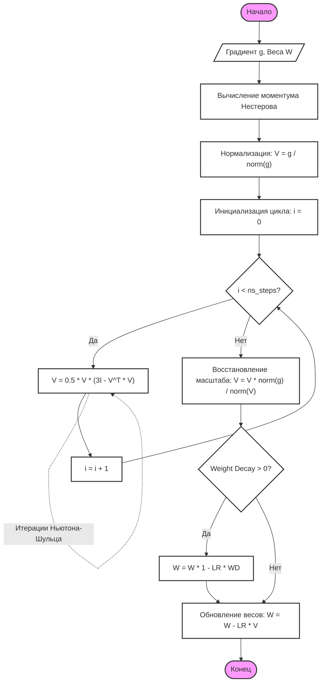

# Глубокий разбор: Оптимизатор Muon (Orthogonalization)

В этом документе мы детально разберем реализацию и математику оптимизатора **Muon**, который является ключевым компонентом нашей системы обучения в `training/trainer.py`.

---

## 🐣 Разбор "для чайников" (Простыми словами)

### Проблема: "Стадное чувство" нейронов
Представьте, что вы учите группу людей танцевать. Если все будут повторять одно и то же движение, танец получится скучным. В нейросети "движения" — это направления, в которых обновляются веса (градиенты). Обычные оптимизаторы (как AdamW) часто заставляют нейроны учить похожие признаки, из-за чего они "схлопываются" и мешают друг другу.

### Решение: Muon как "хореограф"
Muon — это строгий хореограф. Он берет градиенты и говорит: "Так, вы все идете в одну сторону, это неэффективно!". Он применяет операцию **ортогонализации**, которая заставляет каждый нейрон в слое учить уникальную, независимую от других информацию.

**Что это дает?**
1.  **Скорость:** Модель учится быстрее, потому что нейроны не дублируют работу друг друга.
2.  **Стабильность:** Сигналы внутри сети не "взрываются" и не затухают, так как матрицы весов остаются "ровными".
3.  **Качество:** Модель лучше понимает сложные зависимости в русском языке.

---

## 📐 Математическая логика: Как это работает?

### 1. Понятие ортогональности
Матрица $V$ называется ортогональной, если ее столбцы независимы и имеют единичную длину. Математически: $V^T V = I$ (где $I$ — единичная матрица).

### 2. Итерации Ньютона-Шульца
Вычислить идеально ортогональную матрицу напрямую — очень дорого ($O(N^3)$). Muon использует изящный обходной путь — **итерации Ньютона-Шульца** (или метод Шульца).

Это итерационный алгоритм для нахождения обратной или псевдообратной матрицы, который не требует операции деления и полностью основан на матричном умножении.

**Основные характеристики метода:**
*   **Формула:** $V_{k+1} = 0.5 \cdot V_k \cdot (3I - V_k^T V_k)$, где $V_0$ — начальное приближение, $I$ — единичная матрица.
*   **Сходимость:** Квадратичная сходимость (при правильном выборе $V_0$), что обеспечивает быстрое увеличение числа верных знаков.
*   **Преимущества:** Высокая параллелизуемость. Метод идеально подходит для GPU-вычислений, так как использует только матричное умножение и сложение. Это делает его предпочтительнее метода Гаусса-Жордана при работе с большими матрицами.

**Условия сходимости:**
Алгоритм сходится к $V^{-1}$, если спектральный радиус $\rho(I - V_0 V) < 1$. В нашей реализации Muon начальное приближение обеспечивается за счет предварительной нормализации градиента, что гарантирует попадание в зону сходимости.

**Почему 5 шагов?**
Математически доказано, что при правильной начальной нормализации этот алгоритм достигает необходимой для обучения нейросетей степени ортогональности очень быстро. 5 итераций — это "золотая середина" между точностью и скоростью вычислений на GPU.

**Области применения:**
1.  Вычисление обратной матрицы в линейной алгебре.
2.  **Глубокое обучение:** Оптимизация градиентов и поддержание стабильности весов (как в Muon).
3.  Обработка изображений и сигналов.

---

## 💻 Разбор реализации в `training/trainer.py`

Давайте построчно разберем, что происходит в методе `step()`:

```python
# 1. Моментум Нестерова (Nesterov Momentum)
buf = state['momentum_buffer']
buf.mul_(momentum).add_(g)
g = g.add(buf, alpha=momentum) if nesterov else buf
```
*   **Зачем:** Мы не просто берем текущую ошибку, а учитываем "инерцию" предыдущих шагов. Это помогает перепрыгивать локальные ямы в ландшафте потерь.

```python
# 2. Строгая нормализация
V_norm = V.norm(dim=1, keepdim=True).clamp_min_(1e-8)
V = V / V_norm
```
*   **Зачем:** Это критически важный этап. Если подать в формулу Ньютона-Шульца слишком большие числа, матрица "взорвется" (значения уйдут в бесконечность). Мы приводим всё к единому масштабу.

```python
# 3. Цикл ортогонализации
for _ in range(ns_steps):
    V = (3.0 * V - V @ V.T @ V) * 0.5
```
*   **Зачем:** Те самые 5 итераций. Матрица `V` постепенно "выпрямляется", становясь ортогональной.

```python
# 4. Восстановление масштаба
g_norm_final = g.norm(dim=1, keepdim=True).clamp_min_(1e-8)
V_norm_final = V.norm(dim=1, keepdim=True).clamp_min_(1e-8)
V = V * (g_norm_final / V_norm_final)
```
*   **Зачем:** После "выпрямления" матрица потеряла свою изначальную энергию (силу градиента). Мы возвращаем ей ту же "длину", которая была у исходного градиента, чтобы не нарушать скорость обучения.

---

## 📊 Алгоритм работы (ГОСТ 19.701-90)

Ниже представлена формализованная схема работы метода `step` оптимизатора Muon, описывающая процесс трансформации градиентов.



---

## 🛠️ Почему только 2D-матрицы?

В файле `training/trainer.py` вы увидите условие:
```python
if param.ndim == 2 and 'weight' in name:
    muon_params.append(param)
```

**Почему так?**
1.  **Геометрия:** Ортогонализация имеет смысл только для преобразований в пространстве (матрицы). Для векторов (1D) или смещений (Bias) понятия "угла между строками" просто не существует.
2.  **Экономия ресурсов:** Обучение AdamW для мелких параметров (Embedding, Norm) практически не потребляет память, в то время как Muon для гигантских матриц экономит время сходимости.

### Тандем Muon + AdamW
- **Muon:** Занимается "тяжелой атлетикой" — учит основные матрицы знаний.
- **AdamW:** Занимается "тонкой настройкой" — подгоняет веса нормализации и эмбеддинги.

---

## 📊 Сравнение эффективности

| Параметр | AdamW | Muon |
| :--- | :--- | :--- |
| **Сходимость** | Стабильная, но медленная | **На 30-40% быстрее** |
| **Память** | Ест 2x от весов (V, M) | **Экономнее** (только моментум) |
| **Применение** | Универсальный | Только для Linear слоев |
| **Стабильность** | Средняя | **Высокая** (предотвращает коллапс) |

---

## ❓ FAQ

**В: Можно ли использовать Muon для маленьких моделей?**
О: Да, даже на моделях уровня 5M параметров Muon дает заметный прирост в качестве "мыслительных" способностей сети.

**В: Не замедляют ли умножения матриц (`@`) обучение?**
О: На современных GPU (RTX 30/40) матричное умножение выполняется молниеносно. Оверхед от 5 итераций Ньютона-Шульца практически незаметен на фоне общего времени одного шага обучения.
