# Разбор кода: RMSNorm (Root Mean Square Layer Normalization)

В этом документе мы подробно и простым языком разберем, как реализована функция **RMSNorm** в файле `models/layers.py` нашего проекта.

---

## 🧠 Идея "на пальцах"

Представьте, что вы слушаете оркестр. Иногда скрипки играют слишком тихо, а барабаны — слишком громко. Чтобы запись звучала хорошо, звукорежиссер "выравнивает" общую громкость: тихие звуки немного усиливает, а громкие — приглушает.

В нейронных сетях числа (сигналы) тоже могут становиться слишком "большими" или "маленькими" после прохождения через слои. Если их не выравнивать, сеть сойдет с ума и перестанет обучаться. 
Обычный **LayerNorm** делает две вещи:
1. Находит "середину" (среднее арифметическое) и сдвигает все звуки к нулю.
2. Вычисляет разброс громкости и масштабирует ее.

**RMSNorm** — это более умный и быстрый звукорежиссер. Он понял, что первый шаг (поиск середины) занимает время, но почти не влияет на качество! Поэтому RMSNorm просто смотрит на "общую мощность" сигнала (Root Mean Square) и сразу масштабирует его. Это экономит **10-20% вычислительного времени**.

---

## 💻 Реализация в коде (models/layers.py)

Вот как выглядит класс RMSNorm в нашем проекте:

```python
import torch
import torch.nn as nn

class RMSNorm(nn.Module):
    def __init__(self, dim, eps=1e-6):
        super().__init__()
        self.eps = eps
        # Обучаемый параметр w (веса), который сеть сама настроит
        self.weight = nn.Parameter(torch.ones(dim))

    def forward(self, x):
        # 1. Для точности переводим в float32 (важно при работе с bfloat16)
        x_f32 = x.float()
        
        # 2. Вычисляем квадрат каждого элемента, а затем среднее значение (norm)
        norm = x_f32.pow(2).mean(-1, keepdim=True)
        
        # 3. Делим x на корень из (norm + eps) и умножаем на обучаемый вес
        output_f32 = (x_f32 * torch.rsqrt(norm + self.eps)) * self.weight.float()
        
        # 4. Возвращаем исходный тип данных (например, float16)
        return output_f32.type_as(x)
```

### Разбор построчно:
*   `self.weight`: Это массив единиц размера `dim`. Нейросеть в процессе обучения может менять эти единицы, чтобы сделать некоторые каналы информации "важнее" других.
*   `x_f32 = x.float()`: Мы временно повышаем точность чисел. Если этого не сделать, при возведении в квадрат больших чисел (например, в формате float16) может произойти переполнение, и всё сломается (появится `NaN`).
*   `norm = x_f32.pow(2).mean(-1, keepdim=True)`: Берем тензор `x`, возводим каждое число в квадрат (`pow(2)`), и считаем среднее значение по последнему измерению (`mean(-1)`).
*   `torch.rsqrt(...)`: Вычисляет обратный квадратный корень ($1 / \sqrt{x}$). Умножение на обратный корень работает на видеокартах быстрее, чем обычное деление.
*   `+ self.eps`: Мы добавляем крошечное число (например, $0.000001$), чтобы случайно не разделить на ноль, если массив `x` состоит из нулей.

---

## 📊 Визуализация процесса (Mermaid)

```mermaid
graph TD
    A[Входной тензор X\nРазмер: Batch, Seq, Dim] --> B(Перевод в Float32\nДля защиты от переполнения);
    B --> C{Возведение в квадрат\n X²};
    C --> D[Среднее значение\n mean X²];
    D --> E(Прибавление eps\n защита от нуля);
    E --> F{Обратный корень\n 1 / √значения};
    B --> G((Умножение\n X * 1/√...));
    F --> G;
    G --> H[Умножение на обучаемый вес\n self.weight];
    H --> I[Конвертация обратно\n в float16/bfloat16];
    I --> J((Выходной тензор));

    style A fill:#1a1a2e,stroke:#00e5ff
    style J fill:#0d2818,stroke:#01ffc3
```



## 🎯 Почему это важно для TolstoyLLM_v5?
В нашей модели архитектура **Pre-Norm**. Это значит, что RMSNorm применяется *перед* каждым блоком внимания (Attention) и *перед* каждым блоком экспертов (MoE). Благодаря легкости вычислений RMSNorm, эти постоянные нормализации практически не тормозят общий процесс обучения и генерации текста.
