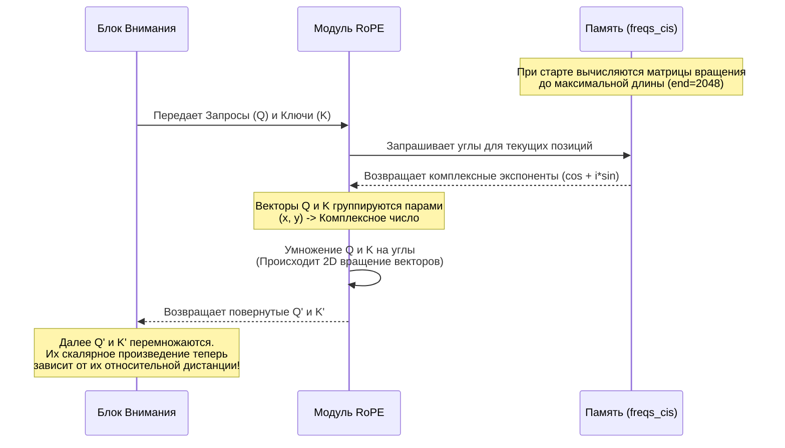

# Разбор кода: RoPE (Rotary Positional Embeddings)

В этом документе мы подробно и понятным языком разберем, как реализована функция позиционного кодирования **RoPE** в файле `models/layers.py`.

---

## 🧠 Идея "на пальцах"

Представьте, что вы читаете предложение: *"Кошка поймала мышку"*.
Для компьютера слова — это просто числа (эмбеддинги). Если не дать компьютеру подсказку, для него *"Кошка поймала мышку"* и *"Мышка поймала кошку"* будут абсолютно одинаковыми наборами чисел.

Раньше к каждому слову просто "приклеивали" бирку: [Слово 1], [Слово 2]. Но это работало плохо на длинных текстах.
**RoPE (Роторное позиционное кодирование)** работает иначе: оно **поворачивает** вектор слова как стрелку компаса. 
*   Слово на позиции 1 повернуто на 10 градусов.
*   Слово на позиции 2 повернуто на 20 градусов.
*   Слово на позиции 3 повернуто на 30 градусов.

Когда механизм "Внимания" (Attention) сравнивает два слова, он смотрит не на их абсолютные позиции, а на **разницу углов** между ними. Разница между 1-м и 3-м словом точно такая же, как между 10-м и 12-м. Это позволяет модели феноменально хорошо понимать структуру предложений любой длины.

---

## 💻 Реализация в коде (models/layers.py)

Реализация разделена на две части: предварительный расчет углов (частот) и само "вращение" во время работы сети.

### Часть 1: Предрасчет углов (`precompute_freqs_cis`)
Чтобы не считать углы каждый раз, мы вычисляем их один раз при запуске модели.

```python
def precompute_freqs_cis(dim, end=2048, theta=10000.0, rope_scaling=None, device='cpu'):
    # Если включен rope_scaling (для удлинения контекста), меняем базу theta
    if rope_scaling is not None and rope_scaling > 1.0:
        theta = theta * (rope_scaling ** (dim / (dim - 2)))
        
    # 1. Вычисляем "скорости вращения" для разных размерностей вектора
    freqs = 1.0 / (theta ** (torch.arange(0, dim, 2, device=device)[: (dim // 2)].float() / dim))
    
    # 2. Создаем позиции токенов (0, 1, 2, 3 ... end)
    t = torch.arange(end, device=device)
    
    # 3. Умножаем позиции на частоты (получаем углы)
    freqs = torch.outer(t, freqs).float()
    
    # 4. Переводим углы в полярные комплексные числа (косинус + i*синус)
    return torch.polar(torch.ones_like(freqs), freqs)
```

### Часть 2: Применение вращения (`apply_rotary_emb`)
Вызывается внутри блока Attention для модификации Запросов (Q) и Ключей (K).

```python
def apply_rotary_emb(xq, xk, freqs_cis):
    # 1. Переводим обычные векторы в комплексные числа
    # [1, 2, 3, 4] -> [1+2i, 3+4i]
    xq_ = torch.view_as_complex(xq.float().reshape(*xq.shape[:-1], -1, 2))
    xk_ = torch.view_as_complex(xk.float().reshape(*xk.shape[:-1], -1, 2))
    
    # 2. Берем нужные углы для текущей длины последовательности T
    T = xq_.shape[1]
    freqs_cis = freqs_cis[:T].view(1, T, 1, xq_.shape[-1])
    
    # 3. Магическое умножение!
    # Умножение комплексных чисел автоматически "вращает" векторы
    xq_out = torch.view_as_real(xq_ * freqs_cis).flatten(3)
    xk_out = torch.view_as_real(xk_ * freqs_cis).flatten(3)
    
    # 4. Возвращаем векторы обратно в обычный формат
    return xq_out.type_as(xq), xk_out.type_as(xk)
```

---

## 📊 Визуализация процесса (Mermaid)



## 🎯 Продвинутая фишка: YaRN и `rope_scaling`
В коде вы могли заметить параметры `rope_scaling`. Если модель обучалась на текстах длиной 2000 слов, а мы хотим загрузить в нее книгу на 8000 слов, обычная модель сломается (она "не знает" углов для позиций > 2000). 
`rope_scaling` (экстраполяция) плавно "сжимает" углы так, чтобы 8000 слов поместились в диапазон, который модель уже выучила. Это позволяет **читать длинные документы без дообучения**!
