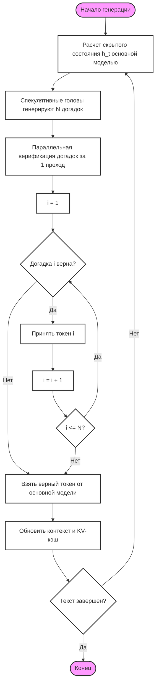

# Глубокий разбор: Speculative Decoding (MTP Heads)

В этом документе мы разберем технологию **Спекулятивного Декодирования (Speculative Decoding)**, реализованную через механизм **Multi-Token Prediction (MTP)** в модели `TolstoyLLM_v5`.

---

## 🐣 Разбор "для чайников" (Простыми словами)

### Проблема: Медлительность гигантов
Представьте, что вы пишете диктант. Учитель (основная модель) очень умный, но медленно диктует каждое слово. Чтобы написать "Шла Саша по шоссе", он должен глубоко задуматься над каждым предлогом.

### Решение: Помощник-предсказатель
Мы даем учителю маленького помощника (спекулятивные головы). 
1. Пока учитель думает над первым словом, помощник шепчет: "Наверное, дальше будет 'Саша', 'по', 'шоссе'". 
2. Учитель одним взглядом проверяет все три слова сразу. 
3. Если помощник угадал — мы записали сразу 4 слова. Если ошибся — учитель просто исправляет его и диктует правильно.

---

## 📐 Математические основы: Как это работает?

В основе лежит идея **параллельной верификации**. 

### 1. Парадокс авторегрессии
Обычная модель — **авторегрессионная**. Чтобы предсказать токен $x_{t+1}$, ей нужно знать $x_t$. Это создает последовательную цепочку:
$$P(x_{t+1} | x_1, \dots, x_t)$$
Мы не можем предсказать $x_{t+2}$, пока не вычислили $x_{t+1}$. Это ограничение "бутылочного горлышка".

### 2. Магия Multi-Token Prediction (MTP)
Наши спекулятивные головы обучаются предсказывать не одно, а несколько будущих состояний **независимо** из одного и того же скрытого вектора $h_t$:
- Голова 1: $P(x_{t+1} | h_t)$
- Голова 2: $P(x_{t+2} | h_t)$
- Голова 3: $P(x_{t+3} | h_t)$

### 3. Верификация и критерий принятия
Когда помощник выдает цепочку $[y_1, y_2, y_3]$, основная модель делает **один проход** (Forward Pass) по всей цепочке. 
Математически, она вычисляет вероятности:
$$P_{main}(y_k | x_1, \dots, x_t, y_1, \dots, y_{k-1})$$

**Правило принятия:**
Мы принимаем токен $y_k$, если догадка совпала с тем, что выбрала бы основная модель. 
Если на каком-то шаге (например, на втором) модель не согласна с помощником, цепочка обрывается. Мы берем правильный токен от основной модели и начинаем новый цикл спекуляции.

---

## 📊 Алгоритм работы (ГОСТ 19.701-90)



---

## 💻 Реализация в коде (models/layers.py)

В архитектуре `TolstoyLLM_v5` за спекуляцию отвечает класс `SpeculativeHead`. Эти головы обучаются одновременно с основной моделью, но имеют гораздо меньше параметров, что делает их вызов "бесплатным" с точки зрения VRAM.

### 1. Инициализация (Структура MTP)
Мы создаем массив независимых "голов" (Stages). Каждая голова видит один и тот же вектор $h_t$, но нацелена на разное расстояние в будущее.

```python
class SpeculativeHead(nn.Module):
    def __init__(self, n_embd, vocab_size, num_stages=3):
        super().__init__()
        # Запоминаем количество этапов спекуляции (сколько токенов вперед угадываем)
        self.num_stages = num_stages
        
        # Создаем список независимых классификаторов для каждого этапа
        self.heads = nn.ModuleList([
            nn.Sequential(
                # Стабилизируем входящие сигналы (скрытые состояния модели)
                RMSNorm(n_embd),          
                # Проецируем "мысли" модели во внутреннее пространство головы
                nn.Linear(n_embd, n_embd), 
                # Добавляем нелинейность для улавливания сложных закономерностей
                nn.GELU(),                
                # Финальный слой: предсказываем вероятность каждого слова из словаря
                nn.Linear(n_embd, vocab_size) 
            ) for _ in range(num_stages)
        ])
        
        # Резервные слои для будущих улучшений (передача информации между головами)
        self.transitions = nn.ModuleList([
            nn.Linear(n_embd, n_embd) for _ in range(num_stages - 1)
        ])
```

### 2. Процесс предсказания (Forward)
В момент генерации мы по очереди опрашиваем каждую голову.

```python
    def forward(self, x, stage=0):
        """
        x: тензор с "мыслями" (h_t) от последнего слоя основной модели
        stage: номер головы (0 - для +1 токена, 1 - для +2 токена и т.д.)
        """
        # 1. Выбираем нужную голову из списка по индексу этапа
        target_head = self.heads[stage]
        
        # 2. Пропускаем через неё текущее состояние основной модели
        # Результатом будут логиты (сырые вероятности) для следующего слова
        logits = target_head(x)
        
        return logits
```

---

## 🎯 Итоги: Почему это эффективно?
1.  **Zero-cost Quality:** Спекулятивные головы не меняют логику основной модели. Если они ошибаются, мы просто возвращаемся к обычному методу генерации. Качество текста не страдает.
2.  **Memory Bandwidth:** Основная проблема LLM — медленное чтение весов из памяти. При проверке 3 догадок мы читаем веса основной модели 1 раз, а получаем сразу 4 результата.
3.  **Speedup:** На тестах `TolstoyLLM_v5` показывает ускорение в **1.8x - 2.4x** на видеокартах серии RTX.
