# Разбор кода: FeedForward (Fused SwiGLU)

В этом документе мы разберем реализацию полносвязного слоя (FFN) с использованием функции активации **SwiGLU**, находящегося в файле `models/layers.py`.

---

## 🧠 Идея "на пальцах"

В любом трансформере есть блок "Памяти" (Attention) и блок "Обработки" (FeedForward). Блок обработки — это место, где нейросеть применяет логические правила к информации. 

**SwiGLU** — это современный тип "логического вентиля". Представьте, что у вас есть две трубы с информацией. 
1. В первой трубе информация фильтруется плавной функцией (**SiLU**).
2. Во второй трубе идет чистая информация.
3. В конце мы **перемножаем** результаты. 

Этот метод оказался гораздо мощнее старых способов (типа ReLU или GELU). Модель с SwiGLU лучше понимает тонкие нюансы текста.

---

## 💻 Реализация в коде (models/layers.py)

В нашем проекте мы используем "сплавленную" (**Fused**) реализацию, которая работает быстрее за счет уменьшения количества операций.

```python
class FeedForward(nn.Module):
    def __init__(self, dim, use_fused_silu=True):
        super().__init__()
        # Магическое число 8/3: 
        # Доказано, что для SwiGLU это идеальное расширение скрытого слоя
        hidden_dim = int(8 * dim / 3)
        # Округляем до ближайшего кратного 256 для ускорения работы GPU (Memory Alignment)
        hidden_dim = 256 * ((hidden_dim + 255) // 256)
        
        # Вместо двух слоев создаем один большой, который делает работу за двоих
        self.gate_up_proj = nn.Linear(dim, 2 * hidden_dim, bias=False)
        self.w2 = nn.Linear(hidden_dim, dim, bias=False)

    def forward(self, x):
        # 1. Прогоняем данные через один большой слой и делим результат пополам (chunk)
        # gate - пойдет в фильтр, up - пойдет как есть
        gate, up = self.gate_up_proj(x).chunk(2, dim=-1)
        
        # 2. Применяем фильтр SiLU и перемножаем
        # Формула: SiLU(gate) * up
        return self.w2(F.silu(gate) * up)
```

---

## 📊 Визуализация процесса (Mermaid)

```mermaid
graph TD
    X["Входной вектор (Dim)"] --> Lin["Большой Слой (gate_up_proj)"]
    
    Lin --> Split{"Разделение пополам\n(Chunk)"}
    
    Split -->|Левая часть| Gate["Gate (Скрытый Dim)"]
    Split -->|Правая часть| Up["Up (Скрытый Dim)"]
    
    Gate --> SiLU["Функция SiLU\n(Плавный фильтр)"]
    
    SiLU --> Mult(("Перемножение\n(*)"))
    Up --> Mult
    
    Mult --> OutLin["Финальный Слой (w2)"]
    OutLin --> Result["Результат (Dim)"]
    
    style Lin fill:#1a1a2e,stroke:#ff2a6d
    style Mult fill:#0d2818,stroke:#01ffc3
```



## 🎯 Почему скрытая размерность `8/3 * dim`?
В оригинальной статье Llama было показано, что для сохранения того же количества параметров, что и в стандартном трансформере (где расширение равно `4 * dim`), при использовании GLU-функций нужно использовать коэффициент `2/3 * 4 = 8/3`. Это позволяет получить более "умную" активацию, не увеличивая нагрузку на видеокарту.
