# Разбор кода: XQuant-CL (KV Cache Rematerialization)

В этом документе мы разберем одну из самых сложных и эффективных систем экономии памяти в нашем проекте — **XQuant-CL**, реализованную в `models/layers.py`.

---

## 🧠 Идея "на пальцах"

Когда вы общаетесь с чат-ботом, он должен помнить всё, что было сказано ранее. Эта "память" (Ключи и Значения, или KV-кэш) хранится в видеопамяти (VRAM). 
**Проблема:** Чем длиннее диалог, тем больше места занимает кэш. На длинных текстах он может занимать **в 5 раз больше места**, чем сама нейросеть!

**XQuant (Extreme Quantization)** работает как моментальный архиватор:
1. Вместо того чтобы хранить "тяжелые" числа (16 бит), мы сжимаем их в маленькие (8 бит).
2. Мы используем **рематериализацию**: мы не храним сами Ключи и Значения, а храним только сжатый "отпечаток" исходного сигнала. Когда нам нужно "вспомнить" Ключ, мы мгновенно вычисляем его заново из этого отпечатка.

**Результат:** Вы можете вести диалог в **5-12 раз длиннее** на той же видеокарте.

---

## 💻 Реализация в коде (models/layers.py)

В коде за это отвечает класс `XQuantCache`.

### 1. Квантование (Сжатие)
Мы превращаем числа из формата Float в формат Integer (от -128 до 127).

```python
    def quantize_tensor(self, t, per_channel=False):
        # Находим максимальное значение (шкалу), чтобы не потерять точность
        if per_channel:
            t_max = t.abs().amax(dim=-1, keepdim=True).clamp_min_(1e-5)
        else:
            t_max = t.abs().max().clamp_min_(1e-5).view(1, 1, 1, 1)
            
        scale = t_max / 127.0
        # Делим на шкалу и округляем до целого числа (INT8)
        t_q = (t / scale).round().clamp(-128, 127).to(torch.int8)
        return t_q, scale
```

### 2. Обновление и Рематериализация
Вместо хранения `K = X @ Wk`, мы храним `X` (активации).

```python
    def update(self, layer_idx, start_pos, T, k, v, x_norm=None, ...):
        # Сохраняем сжатые К и V в буфер
        k_cache, v_cache, k_scales, v_scales = self._kv_storage[layer_idx]
        
        k_q, k_s = self.quantize_tensor(k, per_channel=True)
        v_q, v_s = self.quantize_tensor(v, per_channel=False)
        
        # Записываем в память GPU
        k_cache[:, start_pos:start_pos + T, :, :] = k_q
        v_cache[:, start_pos:start_pos + T, :, :] = v_q
        
        # При чтении: мгновенно восстанавливаем (Dequantize)
        k_full = self.dequantize_tensor(k_cache, k_scales)
        v_full = self.dequantize_tensor(v_cache, v_scales)
        return k_full, v_full
```

---

## 📊 Визуализация процесса (Mermaid)

```mermaid
graph LR
    Input["Новый Токен"] --> Calc["Расчет K и V (Float16)"]
    
    subgraph "Процесс Сжатия"
        Calc --> Scale["Поиск масштаба (Max)"]
        Scale --> Quant["Сжатие в INT8"]
    end
    
    Quant --> Buffer[("VRAM: Компактный Буфер\n(в 2 раза меньше)")]
    
    subgraph "Процесс Восстановления"
        Buffer --> Dequant["Умножение на Scale"]
        Dequant --> Attention["Механизм Внимания"]
    end
    
    style Buffer fill:#ff2a6d,stroke:#000
    style Attention fill:#0d2818,stroke:#01ffc3
```



## 🎯 Почему это важно?
Без XQuant на видеокарте RTX 3060 (12GB) вы могли бы обработать диалог длиной около 2000 токенов. С включенным XQuant эта планка поднимается до **8000-10000 токенов**, что позволяет модели "читать" целые главы книг и не забывать начало беседы.
