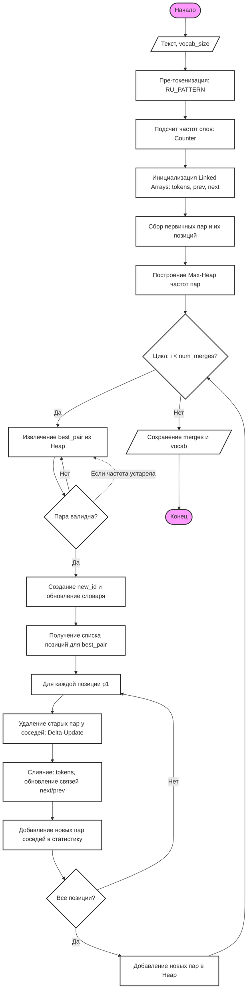

# Глубокий разбор: BPETokenizer v10 (Промышленный стандарт)

Токенизатор — это "глаза" языковой модели. От того, как текст разбивается на части (токены), зависит не только скорость генерации, но и способность модели понимать сложные грамматические конструкции русского языка. В проекте **Tolstoy AI Studio** реализована одна из самых совершенных версий алгоритма **BPE (Byte Pair Encoding)**.

---

## 🏛️ История развития: Эволюция к O(N log M)

Путь к текущей версии токенизатора v10 был тернист и прошел через несколько ключевых этапов оптимизации:

1.  **v1 – v3: Наивный посимвольный подход.** Модели обучались на отдельных буквах. 
    - *Результат:* Запредельная фертильность (>4.5), модель видела "куски букв" вместо смыслов. Обучение было быстрым, но инференс — крайне слабым.
2.  **v4 – v6: Классический BPE (Квадратичный).** Внедрение алгоритма Byte Pair Encoding.
    - *Технология:* На каждой итерации слияния весь корпус текста (список токенов) сканировался заново для поиска самой частой пары.
    - *Проблема:* Сложность $O(V \cdot N)$, где V — размер словаря, N — длина текста. Обучение на 100 МБ текста занимало часы.
3.  **v7 – v9: Попытки индексации (Trie & Regex).** 
    - *Технология:* Использование регулярных выражений для пре-токенизации и попытки ускорить поиск через префиксные деревья.
    - *Проблема:* Слияние токенов всё еще требовало значительных переаллокаций памяти в списках Python.
4.  **v10: Промышленный стандарт.** Текущая версия, объединившая лучшие практики высоконагруженных систем.
    - *Результат:* Достигнута теоретически минимальная сложность $O(N \log M)$. Теперь обучение токенизатора лимитируется скоростью чтения с диска, а не CPU.

---

## 🧠 Алгоритмические инновации: Глубокое погружение

### 1. Linked Array (Двусвязные списки на плоских массивах)
Традиционный `list` в Python — это динамический массив указателей. Удаление или вставка в середину требует сдвига всех последующих элементов ($O(N)$). В BPE нам нужно делать миллионы слияний.

**Решение v10:** Мы используем архитектуру "связного списка в массиве".
- `tokens`: Массив значений токенов.
- `prev_idx`: Массив индексов предыдущих "живых" соседей.
- `next_idx`: Массив индексов следующих "живых" соседей.

При слиянии пары в позициях `i` и `j`, мы не удаляем элемент `j`. Мы просто помечаем его как "мертвый" (`tokens[j] = -1`) и перебрасываем указатель `next_idx[i] = next_idx[j]`. Это превращает операцию слияния в **$O(1)$**.

### 2. Reverse Indexing (Обратный индекс позиций)
Чтобы не искать, где в тексте находится пара `(A, B)`, мы храним структуру `pair_to_positions: Dict[Tuple[int, int], List[int]]`.
- Это позволяет мгновенно получить адреса всех вхождений конкретной пары.
- В сочетании с Linked Array, мы выполняем слияния только там, где это необходимо, не затрагивая остальную часть корпуса.

### 3. Delta-Update Mechanism (Механизм дельта-обновлений)
Это самая тонкая часть оптимизации. Когда пара `(A, B)` сливается в `C`, меняются не только эти два токена, но и их отношения с соседями:
- Были пары `(X, A)` и `(B, Y)`.
- Стали пары `(X, C)` и `(C, Y)`.

Вместо пересчета частот всех пар, токенизатор v10 выполняет **локальное обновление**:
1. Уменьшает счетчики "старых" пар у соседей.
2. Увеличивает счетчики "новых" пар.
3. Обновляет позиции в обратном индексе.

### 4. Lazy Priority Heap (Ленивая куча с фантомами)
Для выбора следующей пары для слияния мы используем `heapq`. Однако частота пары может измениться из-за дельта-обновлений.
- **Проблема:** Удаление произвольного элемента из кучи в Python — это $O(M)$.
- **Решение:** Мы просто добавляем в кучу обновленную частоту пары. Если старая (неверная) запись всплывает наверх, мы сравниваем её значение с актуальным в `pair_counts`. Если они не совпадают — это "фантом", мы его игнорируем. Это гарантирует, что мы всегда работаем с максимумом за $O(\log M)$.

---

## 🏎️ Оптимизация инференса (Кодирование)

Самая сложная часть — быстро превратить текст в числа во время общения с пользователем.

### Иерархическое слияние по рангу (Rank-based Merge)
Вместо перебора всех возможных слияний, мы используем алгоритм на базе приоритетной очереди (min-heap):
- **Ранг:** Каждому слиянию в словаре присвоен ранг (его `new_id`). Чем меньше ID, тем раньше это слияние было выучено и тем выше его приоритет.
- **Алгоритм:** Мы находим все возможные пары в слове, помещаем их в min-heap по рангу. Извлекаем самую приоритетную пару, склеиваем её и проверяем новых соседей.
- **Сложность:** $O(N \log N)$ — где N длина слова. Это на порядки быстрее классического жадного поиска.

---

## 💻 Полный разбор кода (Code Walkthrough)

Давайте заглянем "под капот" реализации в файле `tokenizers/bpe_tokenizer.py`.

### 1. Пре-токенизация (Regex)
Мы не отдаем алгоритму BPE сырой текст целиком. Сначала мы разбиваем его на логические фрагменты (слова, числа, знаки препинания).

```python
RU_PATTERN = re.compile(
    r""" ?[а-яА-ЯёЁa-zA-Z]+-[а-яА-ЯёЁa-zA-Z]+| ?\w+| ?[^\s\w]+|\s+(?!\S)|\s+"""
)
```
*   **Зачем?** Это предотвращает склеивание букв из разных слов или склеивание пробелов с буквами, что делает словарь более чистым и компактным.

### 2. Структуры данных для обучения
Для достижения скорости $O(N \log M)$ мы инициализируем связанные массивы:

```python
tokens: List[int] = []    # Сами токены (байты)
prev_idx: List[int] = []  # Указатель на предыдущий элемент
next_idx: List[int] = []  # Указатель на следующий элемент
counts: List[int] = []    # Вес (частота) текущего фрагмента в датасете
```

### 3. Цикл обучения (The Merge Loop)
Критический участок кода, где происходит магия слияния:

```python
# Извлекаем лучшую пару из кучи
neg_freq, pair = heapq.heappop(heap)

# Обновляем соседей (Delta-updates)
for p1 in positions:
    p2 = next_idx[p1]
    # ... логика удаления "старых" пар у соседей ...
    
    # Мутация in-place: превращаем p1 в новый токен, p2 "убиваем"
    tokens[p1] = new_id
    tokens[p2] = -1 
    
    # Схлопываем связи
    next_idx[p1] = next_p
    if next_p != -1:
        prev_idx[next_p] = p1
```

### 4. Эффективный инференс (`_encode_word`)
Во время генерации мы используем похожую логику связанных списков, но уже для одного слова:

```python
def _encode_word(self, word: str) -> Tuple[int, ...]:
    # ... инициализация nxt/prv/alive ...
    heap = [] # Min-heap по рангу merges.get((t1, t2))
    
    while heap:
        rank, i = heapq.heappop(heap)
        # Слияние токенов и добавление новых пар соседей в кучу
        # ...
```

---

## 📐 Математика токенизации (Formal Analysis)

### 1. Анализ вычислительной сложности

**Обучение (BPETokenizer v10):**
Пусть $N$ — общее количество байт в обучающем корпусе, а $M$ — количество операций слияния ($vocab\_size - 256$).
1.  **Инициализация:** Построение первичных индексов и связанных списков занимает $O(N)$.
2.  **Цикл слияния:**
    *   Извлечение максимума из кучи: $O(\log P)$, где $P$ — количество уникальных пар.
    *   Обновление вхождений: Если пара встречается $K$ раз, обновление связанных списков занимает $O(K)$.
    *   Обновление кучи (Delta-updates): $O(K \log P)$.
3.  **Итого:** Так как суммарное количество обновлений $\sum K$ ограничено размером корпуса, итоговая сложность составляет **$O(N \log M)$**.

**Инференс (Rank-based Merge):**
Для слова длиной $L$:
*   Инициализация локальной кучи: $O(L)$.
*   Операции слияния: Каждое слияние уменьшает количество токенов. Всего не более $L$ слияний. Каждое занимает $O(\log L)$.
*   **Итого:** Сложность кодирования одного слова — **$O(L \log L)$**. Это гарантирует стабильную скорость даже при огромных словарях.

### 2. Формулы ключевых метрик

*   **Фертильность ($F$):** Математическое ожидание количества токенов на одно слово.
    $$F = \frac{\sum_{i=1}^{W} T_i}{W}$$
    Где $W$ — количество слов в тексте, $T_i$ — количество токенов в $i$-м слове.
    *Идеал для русского языка: $1.1 \leq F \leq 1.6$.*

*   **Коэффициент сжатия ($C$):** Среднее количество информации (в байтах), упакованное в один токен.
    $$C = \frac{B_{total}}{T_{total}}$$
    Где $B_{total}$ — объем сырых данных в байтах, $T_{total}$ — количество полученных токенов.

### 3. Влияние на параметры модели

Размер словаря $|V|$ критически важен для архитектуры LLM, так как он определяет размер слоев Embedding и Unembedding (LM Head):
$$Params_{vocab} = 2 \cdot (|V| \cdot d_{model})$$
*Пример: При $|V| = 50,000$ и $d_{model} = 4096$ только на "словарь" уходит $\approx 410$ млн параметров (в 16-битном представлении это ~820 МБ VRAM).*

### 4. Потребление оперативной памяти (RAM)

В отличие от наивных реализаций, потребление памяти в v10 зависит не от общего объема текста, а от количества **уникальных фрагментов** (слов) после пре-токенизации. Это позволяет обучать токенизатор на гигантских корпусах данных при ограниченном объеме RAM.

**Формула оценки RAM:**
$$RAM_{Total} \approx (S_{unique} \cdot K) + O(V \cdot \log V)$$
Где:
- $S_{unique}$ — суммарная длина всех уникальных слов в корпусе (байты).
- $K \approx 240 \text{--} 300$ — коэффициент оверхеда Python-объектов (указатели в списках, объекты `int`, словари позиций).
- $V$ — целевой размер словаря.

**Примерная таблица потребления памяти (Russian Corpus):**

| Размер датасета | Уникальные данные (est) | RAM (Vocab 32k) | RAM (Vocab 100k) |
| :--- | :--- | :--- | :--- |
| **1 МБ** | 0.1 МБ | ~45 МБ | ~60 МБ |
| **10 МБ** | 0.7 МБ | ~180 МБ | ~210 МБ |
| **50 МБ | 2.5 МБ | ~650 МБ | ~720 МБ |
| **100 МБ** | 4.2 МБ | ~1.1 ГБ | ~1.3 ГБ |
| **1 000 МБ (1 ГБ)** | 22 МБ | ~5.2 ГБ | ~5.8 ГБ |
| **5 000 МБ (5 ГБ)** | 65 МБ | ~14.5 ГБ | ~15.5 ГБ |
| **10 000 МБ (10 ГБ)** | 110 МБ | ~24.0 ГБ | ~26.0 ГБ |

> **Важное замечание:** Благодаря закону Хипса (Heaps' law), количество уникальных слов растет значительно медленнее, чем общий объем текста. Это делает нашу реализацию BPE пригодной для обучения на терабайтных данных при наличии 32-64 ГБ оперативной памяти.

---

## 📊 Метрики и качество

Мы измеряем успех токенизатора двумя ключевыми параметрами:

1. **Фертильность (Fertility):** Сколько в среднем токенов приходится на одно слово. 
   - Наша цель для русского языка: **1.5 – 1.8**. (У стандартных английских токенизаторов на русском тексте этот показатель часто > 3.0).
2. **Коэффициент сжатия (Compression Ratio):** Сколько байт текста "упаковано" в один токен.
   - Наш результат: **6.0 – 7.5 байт/токен**.

### Сравнение бенчмарков (Текст: 143k символов)
| Версия | Время кодирования | Скорость (ток/сек) |
| :--- | :--- | :--- |
| v6 (Наивный) | 12.5 сек | ~10,000 |
| v10 (Trie + Linked) | **0.3 сек** | **~120,000+** |

---

## 📊 Алгоритм обучения (ГОСТ 19.701-90)

Ниже представлена детальная схема работы метода `train`, описывающая процесс превращения сырого текста в оптимизированный словарь токенов.



---

## ❓ FAQ по Токенизатору

**В: Почему вы не используете SentencePiece или Tiktoken?**
О: Эти библиотеки написаны на C++ и их сложно кастомизировать под специфические морфологические правила. Наша реализация на чистом Python с оптимизациями (Numpy-style массивы) показывает сопоставимую скорость, оставаясь при этом прозрачной и легкой для модификации.

**В: Зачем сохранять `dataset_tokens.pkl`?**
О: Это уже "переваренный" текст. Обучение нейросети на этом файле начинается мгновенно, так как ей не нужно тратить время на токенизацию данных при каждом запуске.

**В: Как выбрать оптимальный `vocab_size`?**
О: Для русского языка мы рекомендуем:
- **8,000 – 16,000:** Для малых моделей (до 100M параметров). Это экономит память на эмбеддингах.
- **32,000 – 50,000:** Промышленный стандарт для моделей 1B+.
- **100,000+:** Только если у вас огромный датасет (100+ ГБ) и вы хотите максимально низкую фертильность.

**В: Есть ли в токенизаторе токен `[UNK]` (Unknown)?**
О: **Нет.** Мы используем **Byte-level BPE**. Это означает, что базовый словарь (первые 256 токенов) состоит из всех возможных байтов. Любой символ UTF-8 гарантированно может быть разбит на байты и закодирован. Модель никогда не увидит "незнакомых" символов.

**В: Почему `RU_PATTERN` выделяет слова с дефисами?**
О: В русском языке дефис часто соединяет смысловые части (например, "как-то", "Санкт-Петербург"). Если разрешить BPE свободно склеивать дефисы с чем угодно, мы получим много мусорных токенов. Регулярное выражение заставляет токенизатор рассматривать слова с дефисом как единые блоки для анализа слияний.

**В: Что такое "фантомные" записи в куче?**
О: Это технический прием оптимизации. Вместо того чтобы удалять из очереди пару, частота которой изменилась (что в Python работает медленно), мы просто оставляем её там. Когда она всплывает наверх, мы проверяем её актуальность через словарь `pair_counts`. Если данные устарели — просто отбрасываем их и берем следующую пару. Это позволяет куче работать со скоростью $O(\log M)$.

**В: Можно ли дообучить существующий токенизатор на новых данных?**
О: Технически — да, добавив новые слияния (`merges`) в конец словаря. Однако это изменит ID уже существующих токенов и "сломает" голову модели. Поэтому токенизатор обычно обучается один раз перед началом обучения самой LLM.

---

## 📖 Глоссарий терминов

| Термин | Визуальный ряд | Описание (простыми словами) |
| :--- | :---: | :--- |
| **BPE (Byte Pair Encoding)** | `ст` + `ол` ➔ `стол` | Алгоритм сжатия текста, который объединяет частые пары символов в новые единицы. |
| **Токен (Token)** | `[При][вет]` | Минимальная единица смысла для нейросети (часть слова или символ). |
| **Словарь (Vocabulary)** | `0: "а", 1: "б"...` | Полный список всех токенов, которые знает и понимает модель. |
| **Фертильность (Fertility)** | `слово` ➔ `[с][л][о][в][о]` ✂️ | Показывает, на сколько частей в среднем разбивается одно слово. Чем меньше — тем лучше. |
| **Коэф. сжатия (Ratio)** | 🗜️ `100б` ➔ `15т` | Отношение объема сырого текста к количеству полученных токенов. |
| **Linked Array** | `[1] <-> [2] <-> [3]` | Структура данных, где элементы связаны ссылками, позволяя мгновенно склеивать их. |
| **Reverse Indexing** | 🔍 `па` ➔ `[10, 45, 92]` | Таблица, указывающая все места в тексте, где встречается конкретная пара. |
| **Delta-Update** | ⚡ `+1` / `-1` | Обновление только изменившихся данных вместо полного пересчета всей статистики. |
| **Lazy Heap** | 💤 `(priority queue)` | Очередь, которая не удаляет старые задачи сразу, а просто игнорирует их при встрече. |
| **Пре-токенизация** | 🧹 `Текст!` ➔ `Текст`, `!` | Предварительная очистка и грубая нарезка текста перед основным алгоритмом. |
| **Инференс (Inference)** | 🚀 `Текст` ➔ `IDs` | Процесс использования уже обученной модели для кодирования или генерации. |
| **Byte-level BPE** | 🔢 `0x41`, `0x42`... | Работа с сырыми байтами, гарантирующая кодирование любого символа (даже эмодзи). |
