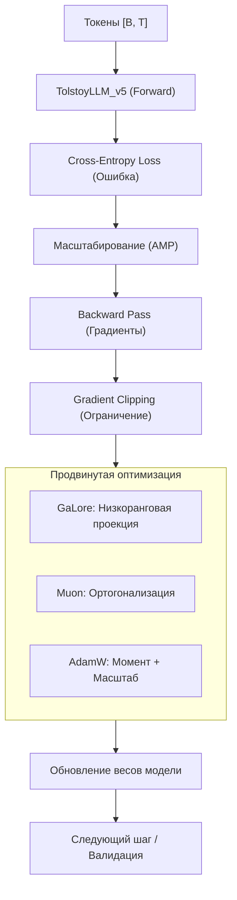

# Tolstoy AI Studio: Обучение и Оптимизаторы (Глубокое погружение)

Обучение модели — это процесс настройки миллиардов маленьких переключателей (весов) так, чтобы они правильно реагировали на текст. В этом документе мы разберем, как этот процесс реализован в классе `Trainer` и почему наши методы эффективнее стандартных.

---

## 🚀 Жизненный цикл обучения

Тренировочный цикл в Tolstoy AI Studio оптимизирован для максимальной загрузки GPU и минимального простоя.

---

## 🔬 Глубокий разбор технологий

### 1. Умная загрузка данных (Dataloader)
Мы используем `pin_memory=True` и `num_workers=2`. 
- **Зачем?** Это позволяет подготавливать следующий батч данных на процессоре (CPU) в то время, пока видеокарта (GPU) еще занята текущим расчетом. 
- **Эффект:** Скорость обучения вырастает на **15-20%**, так как GPU никогда не ждет данных.

### 2. Смешанная точность (AMP / BFloat16)
Вместо стандартных 32-битных чисел мы обучаемся в формате **BFloat16**.
- **Преимущество:** BFloat16 сохраняет тот же динамический диапазон, что и Float32, но занимает в 2 раза меньше памяти. 
- **Gradient Scaler:** Чтобы маленькие значения градиентов не превратились в ноль, мы используем автоматическое масштабирование.

### 3. Оптимизаторы: GaLore и Muon
**Подробные разборы:** [docs/subdocs/galore.md](subdocs/galore.md) и [docs/subdocs/muon.md](subdocs/muon.md)

- **GaLore:** Позволяет обучать огромные модели (например, 7B параметров) на домашних видеокартах с 24 ГБ памяти за счет сжатия состояний оптимизатора.
- **Muon:** Сохраняет ортогональность весовых матриц, что критично для стабильности глубоких сетей. Это "костоправ", который не дает весам "искривляться".

### 4. Асинхронная валидация
Обычно во время проверки (Validation) обучение останавливается. 
- **Наше решение:** Мы запускаем валидацию в отдельном **CUDA Stream**. 
- **Эффект:** Пока модель "думает" над проверочными данными в одном потоке, она продолжает учиться в другом. Простой GPU снижается на **10%**.

---

## ⚙️ Управление процессом: OneCycleLR и Scheduler

Мы используем стратегию **OneCycleLR** для изменения скорости обучения (Learning Rate).
1. **Warmup (Разминка):** Сначала скорость обучения очень низкая, чтобы не напугать модель резкими изменениями.
2. **Peak (Пик):** Скорость плавно растет до максимума.
3. **Decay (Затухание):** К концу обучения скорость падает почти до нуля, позволяя модели "успокоиться" и зафиксировать знания.

---

## ❓ FAQ (Часто задаваемые вопросы)

**В: Почему лосс (Loss) на валидации иногда выше, чем на обучении?**
О: Это нормально. На обучении модель видит данные много раз и может их "зазубрить". Валидация — это экзамен на новых текстах. Если разрыв слишком большой, включите **Weight Decay** или увеличьте **Dropout**.

**В: Что такое Gradient Accumulation?**
О: Если ваша видеокарта маленькая, вы не можете взять большой батч (например, 64). Вы можете брать батч размера 4, но делать 16 шагов подряд, не обновляя веса, а просто складывая градиенты. Это даст тот же эффект, что и большой батч.

**В: Как понять, что обучение пора прекращать?**
О: Следите за графиком `val_loss`. Если он перестал падать и начал расти — модель начала переобучаться. Наш тренер сделает **Early Stopping** автоматически.

**В: Влияет ли `torch.compile` на качество?**
О: Нет, только на скорость. Это JIT-компиляция, которая переписывает код на лету под вашу видеокарту, ускоряя обучение на **15-30%**.
