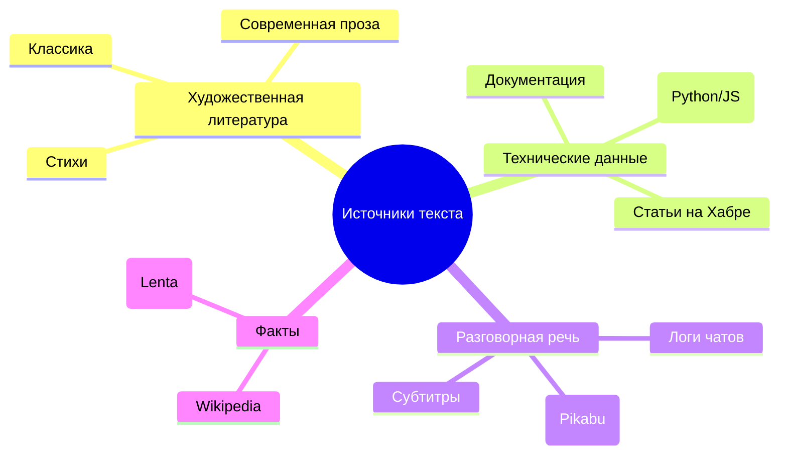

# 📂 Туториал 1: Искусство создания датасета

> **"Data is the new oil, but only if it's refined."**  
> В мире LLM качество ваших данных определяет "потолок" возможностей вашей модели.

---

## 🏗️ 1. Стратегия сбора данных: Глубокое погружение

Сбор данных — это не просто "скачивание всего интернета". Это архитектурный процесс.

### 📊 1.1. Матрица "Объем vs Мозг"
Используйте эту таблицу для планирования. Помните: лучше 100 МБ идеального текста, чем 1 ГБ "шума".

| Пресет модели | Параметры | Идеальный датасет (символы) | Объем в тексте (UTF-8) | Реком. Vocab Size |
| :--- | :--- | :--- | :--- | :--- |
| **Nano / Mini** | 5M - 25M | 50k - 200k | ~50 - 200 КБ | 1024 - 2048 |
| **Small / Chat** | 80M - 150M | 1M - 5M | ~1 - 5 МБ | 4096 - 8192 |
| **Medium / Large** | 350M - 1B | 10M - 100M | ~10 - 100 МБ | 8192 - 16384 |
| **XLarge** | 3B+ | 500M+ | ~500 МБ+ | 32000 |

### 🔍 1.2. Категории данных и их влияние
Каждый тип данных учит модель определенному навыку:
1.  **Формальный (Wikipedia, Новости):** Учит грамматике, пунктуации и фактам. Это "скелет" модели.
2.  **Художественный (Классика, Проза):** Учит метафорам, богатому словарному запасу и структуре повествования.
3.  **Разговорный (Форумы, Чаты):** Учит сленгу, сокращениям и естественному ритму диалога.
4.  **Технический (Код, Документация):** Учит логике, структурам и причинно-следственным связям.

### 🧭 1.3. Выбор источников (Mindmap)

---

## 🛠️ 2. Пайплайн подготовки в CLI: Как это работает внутри

Когда вы выбираете **Меню [1]**, Tolstoy AI Studio запускает сложный конвейер обработки.

### 📥 2.1. Мультиформатный сбор (Aggregation)
CLI поддерживает не только `.txt`. Вот как обрабатываются другие форматы:
*   **PDF:** Текст извлекается постранично через `PyPDF2`. Помните: PDF со сканами (картинками) без слоя текста не будет прочитан!
*   **DOCX:** Структурированное извлечение параграфов.
*   **JSON:** Скрипт рекурсивно ищет все строковые значения в объекте. Это идеально для импорта экспортов из Telegram или WhatsApp.
*   **XML:** Извлекает текстовое содержимое всех тегов, игнорируя атрибуты.
*   **CSV:** Объединяет все колонки в каждой строке через пробел.

### 🧹 2.2. Алгоритм очистки (The `clean_text` logic)
Наша функция очистки работает по принципу "Минимальное вмешательство — максимальная чистота":
1.  **Unicode Sanitization:** Удаляются невидимые управляющие символы (ASCII 0-31), которые могут "свести с ума" токенизатор.
2.  **Whitespace Normalization:** Все повторяющиеся пробелы, табы и странные переносы строк превращаются в один стандартный пробел.
3.  **Leading/Trailing Strip:** Удаление пустых мест в начале и конце всего корпуса.

### 👯 2.3. Дедупликация и Шум
**Дедупликация** — это критический этап. Если в вашем датасете 100 раз встречается одна и та же статья, модель решит, что это самая важная информация в мире.
*   *Совет:* Перед загрузкой в CLI удалите явно повторяющиеся файлы.
*   *Шум:* Если в тексте много "мусора" (например, `ADVERT: click here`, `Page 1 of 100`), постарайтесь удалить его заранее. Модель очень быстро учится плохому!

---

## 💡 3. Секреты экспертов: Искусство Mix & Match

Создание датасета — это алхимия. Вы смешиваете разные ингредиенты, чтобы получить золото в виде "умных" ответов.

### ⚖️ 3.1. Правило золотой пропорции (70/20/10)
Для универсальной модели "общего назначения" придерживайтесь следующего состава:
*   **70% "Фундаментальные знания" (The Base):** 
    *   *Что это:* Википедия, качественные новости, классическая литература.
    *   *Зачем:* Это формирует грамматический скелет, учит модель строить сложные предложения и дает базовое понимание мира.
*   **20% "Специализация и Стиль" (The Soul):** 
    *   *Что это:* Ваши личные тексты, логи чатов, техническая документация вашей отрасли.
    *   *Зачем:* Это придает модели индивидуальность и делает её экспертом в нужной вам области.
*   **10% "Разнообразие и Код" (The Edge):** 
    *   *Что это:* Стихи, куски кода (даже если модель не про код), математические формулы, форумы с жаргоном.
    *   *Зачем:* Это предотвращает "закостенелость" (overfitting на одном стиле) и учит модель логике структур.

### 💎 3.2. Информационная плотность (High-Quality vs Low-Quality)
Не все тексты одинаково полезны.
*   **Высокая плотность:** Научные статьи, учебники, профессиональные блоги (Habr). Здесь почти каждое предложение несет смысл.
*   **Низкая плотность:** Социальные сети, комментарии под видео, расшифровки подкастов. Много "воды", приветствий и бессмысленных междометий.
*   **Совет:** Если у вас мало данных, делайте ставку на учебники. Один учебник по физике даст модели больше "логических связей", чем 1000 постов из Твиттера.

### 🤖 3.3. Синтетический буст (Synthetic Data)
Если вам не хватает данных в специфической нише, вы можете использовать другие, более крупные модели (например, ChatGPT или Claude) для генерации текстов для вашей модели.
*   *Пример:* Попросите крупную модель написать 500 коротких рассказов в стиле Достоевского или 1000 диалогов техподдержки.
*   *Результат:* Ваша маленькая модель TolstoyLLM будет учиться на "идеальных" примерах от старших братьев. Это называется **Distillation** (Дистилляция знаний).

### 🧠 3.4. Отраслевая экспертиза
Хотите сделать модель-юриста или модель-программиста?
1.  **Терминология:** Добавьте словари терминов и их определения в явном виде.
2.  **Примеры решений:** Вместо просто сухих законов добавьте реальные кейсы с разбором: "Проблема -> Анализ -> Решение". 
3.  **Логические цепочки:** Как упоминалось в Pro Tip, математика и логика учат модель "думать" шагами, а не просто угадывать следующее слово.

> [!TIP]
> **Pro Tip:** Если вы обучаете модель на очень специфическом сленге, убедитесь, что в датасете есть хотя бы немного стандартного русского языка, иначе модель "разучится" говорить по-человечески.

---

## 🛑 4. Чего НЕЛЬЗЯ делать
1.  **Мешать языки хаотично:** Если датасет на 90% русский и 10% китайский, модель будет пытаться вставлять иероглифы в русские слова.
2.  **Оставлять OCR-ошибки:** Текст со сканера с ошибками вроде `пpивeт` (где 'p' английская) сломает токенизатор.
3.  **Использовать только один жанр:** Модель на одних лишь юридических договорах будет общаться с вами как бюрократ.

---

➡️ **Далее:** [Как превратить этот текст в числа? (Туториал по токенизации)](3_tokenization_guide.md)
