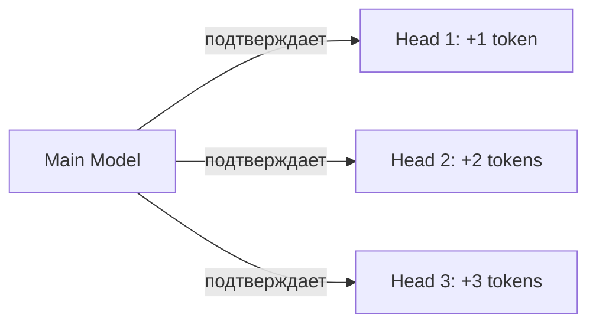
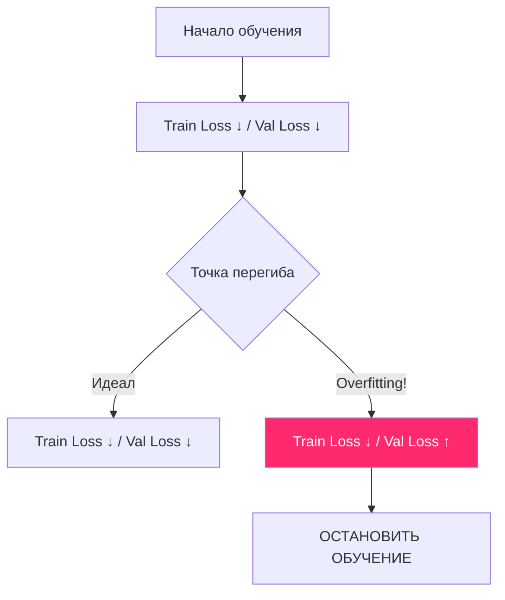

# 🏋️ Туториал 2: Мастер-класс по обучению

> **Обучение модели — это танец между скоростью вычислений и доступной памятью.**

---

## 🧠 1. Анатомия пресетов

В Tolstoy AI Studio пресеты — это не просто наборы цифр, это выверенные конфигурации.

### 📋 Сводная таблица конфигураций

| Пресет | Layers | Heads | Embedding | Block Size | Особенности |
| :--- | :---: | :---: | :---: | :---: | :--- |
| **Nano** | 1 | 2 | 64 | 128 | Ультра-легкая сеть для отладки на любом железе. |
| **Mini** | 2 | 4 | 128 | 256 | Идеально для тестов на CPU. |
| **Small** | 4 | 8 | 256 | 512 | Базовая модель для простых задач. |
| **Logic** | 12 | 6 | 384 | 1024 | Глубокая и узкая сеть для сложных связей. |
| **Chat** | 6 | 8 | 512 | 2048 | Увеличенное окно контекста для диалогов. |
| **Medium**| 8 | 8 | 512 | 1024 | Золотая середина для RTX 3060 (12GB). |
| **Large** | 12 | 12 | 768 | 1024 | Полноценный "тяжеловес" для глубокого понимания. |
| **XLarge**| 16 | 16 | 1024 | 2048 | Максимальный масштаб для 24GB VRAM. |

---

## ⚡ 2. Магия оптимизаций: Глубокое погружение

### 🛡️ GaLore (Gradient Low-Rank Projection)
Это ваша "палочка-выручалочка". 
*   **Как это работает:** Вместо того чтобы хранить градиенты для всей огромной матрицы весов (например, 4096x4096), GaLore проецирует их в маленькое пространство (например, 4096x128).
*   **Результат:** Вы можете обучать модель в 2-3 раза большего размера на той же видеокарте.

### 🔮 Speculative Decoding Heads
Если вы включите эту опцию, вы обучаете не одну модель, а "модель с помощниками".

Это увеличивает время обучения на ~15%, но ускоряет генерацию в чате на **200-300%**.

---

## 🌡️ 3. Мониторинг и "Здоровье" обучения

Во время обучения CLI выводит лог каждые 10 итераций. Понимание этих цифр — разница между "умной" моделью и бесполезным набором чисел.

### 📉 3.1. Анализ кривых потерь (Loss)

**Loss (Потери)** — это показатель того, насколько сильно предсказания модели отличаются от реальности. Чем он ниже, тем лучше модель "понимает" текст.

*   **Train Loss:** Показывает, насколько хорошо модель усваивает обучающий датасет. В норме он должен плавно и неуклонно падать.
    *   *Аномалия:* Если лосс "застрял" на одном месте (например, на 8.0) — модель не учится. Попробуйте увеличить `Learning Rate`.
    *   *Аномалия:* Если лосс упал до 0.0001 — модель просто "зазубрила" текст (Overfitting), она не сможет генерировать ничего нового.
*   **Val Loss (Валидационный лосс):** Самая критическая метрика. Модель проверяет свои знания на куске текста, который она **не видела** при обучении.

#### Как распознать переобучение (Overfitting)?

### 📈 3.2. Learning Rate (Скорость обучения) и OneCycleLR

Мы используем продвинутый планировщик **OneCycleLR**. Вместо того чтобы держать скорость обучения постоянной, он меняет её по графику "колокола":
1.  **Phase 1 (Warmup):** LR быстро растет. Это "прогрев", который помогает модели найти правильное направление градиентов.
2.  **Phase 2 (Annealing):** LR плавно падает до минимума. Это позволяет модели "успокоиться" и аккуратно настроить веса в локальном минимуме.

> [!TIP]
> **Секрет:** Если вы видите, что `Train Loss` падает слишком медленно, попробуйте увеличить базовый `LR` в настройках, но следите, чтобы модель не "взорвалась" (NaN loss).

### 🛑 3.3. Автоматика: Early Stopping

В `Tolstoy AI Studio` встроена система "Ранней остановки". Если `Val Loss` перестает падать в течение долгого времени (параметр `patience`), обучение прекратится автоматически.
*   Это бережет ваш GPU от лишнего износа.
*   Это гарантирует, что вы получите лучшую версию модели (чекпоинт `_best.pth`), а не ту, что успела переобучиться.

### ⏱️ 3.4. Скорость и ETA
CLI отображает время выполнения и примерное время до конца (**Time Remaining**). 
*   Если одна итерация занимает более 5-10 секунд на маленьком пресете — проверьте, не занят ли GPU другой задачей (например, игрой или браузером).
*   Использование **GaLore** может немного замедлить одну итерацию, но позволит обучить гораздо более качественную модель.

---

## 🛠️ 4. Железный гайд: Что выбрать?

| Ваше железо | Рекомендуемый сетап | Опции |
| :--- | :--- | :--- |
| **Laptop (Integrated GPU)** | Preset: `Nano` | Device: `cpu` |
| **RTX 3060 (12GB)** | Preset: `Small` / `Chat` | **GaLore: ON**, 8-bit: OFF |
| **RTX 3090 / 4090 (24GB)**| Preset: `Medium` / `Large`| GaLore: Optional, **Speculative: ON** |
| **2x RTX 4090 / A100** | Preset: `XLarge` | GaLore: OFF, FlashAttention: ON |

> [!IMPORTANT]
> **Внимание:** Перед началом обучения на Windows убедитесь, что в системе установлен `Pagefile` (файл подкачки) размером не менее 32 ГБ, иначе PyTorch может "вылететь" при загрузке больших тензоров.

---

## ❓ FAQ по обучению

**В: Можно ли прервать обучение и продолжить потом?**
О: Да! Просто выберите тот же файл датасета и укажите имя модели. Если файл `.pth` уже существует, CLI предложит продолжить обучение с последнего чекпоинта.

**В: Моя видеокарта греется до 90 градусов. Это нормально?**
О: Обучение LLM — это "стресс-тест". Мы рекомендуем ограничить Power Limit видеокарты (через MSI Afterburner) до 70-80%. Это снизит нагрев на 15 градусов при потере скорости всего в 5%.
