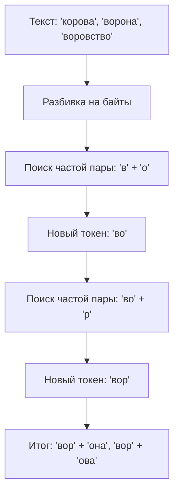

# ✂️ Туториал 3: Токенизация — Мост между словами и числами

> **Токенизация — это не просто нарезка текста. Это создание фундаментального языка, на котором ваша модель будет "думать".**

---

## 🔄 1. Как работает BPE (Byte-Pair Encoding)? Глубокий разбор

BPE — это итеративный алгоритм сжатия данных. Его магия заключается в том, что он находит "золотую середину" между побуквенным письмом и словарем целых слов.

### ⚙️ Процесс по шагам:
1.  **Байтовый фундамент:** Токенизатор v10 начинает с 256 базовых токенов (все возможные байты UTF-8). Это гарантирует, что мы сможем закодировать **любой** текст, даже если в нем есть редкие эмодзи или иероглифы.
2.  **Поиск пар:** Алгоритм сканирует датасет и находит самую частую пару токенов (например, `о` и `в`).
3.  **Слияние (Merge):** Создается новый токен `ов`, который заменяет эту пару.
4.  **Итерация:** Процесс повторяется тысячи раз, пока мы не наберем нужное количество слияний (`Vocab Size`).



---

## 📏 2. Калькулятор размера словаря: Влияние на систему

Выбор `Vocab Size` — это не только вопрос качества, но и вопрос ресурсов вашего GPU.

| Объем датасета (символы) | Рекоменд. Vocab Size | Влияние на VRAM | Влияние на Скорость |
| :--- | :--- | :--- | :--- |
| **< 50,000** | **1,024** | Минимальное. | Высокая (короткие токены). |
| **50,000 - 200,000** | **2,048** | ~50 МБ доп. памяти. | Оптимально. |
| **200,000 - 1,000,000** | **4,096** | ~100 МБ доп. памяти. | Высокая эффективность. |
| **> 1,000,000** | **8,192 - 16,384** | ~200-500 МБ доп. памяти.| Максимальное сжатие. |

### ⚠️ Опасные зоны:
*   **Слишком мало (Vocab < 512):** Последовательности чисел станут слишком длинными. Если `block_size` вашей модели 512, то в него влезет всего 100-150 слов. Модель будет иметь "короткую память".
*   **Слишком много (Vocab > 50,000):** Матрица эмбеддингов (Embeddings Table) станет огромной. Это не только съест VRAM, но и приведет к тому, что большинство весов токенов останутся "холодными" (модель их не выучит).

---

## 🧪 3. Анализ качества (Metrics) и "Красные флаги"

Когда CLI выводит таблицу, ищите следующие показатели:

### 1. Фертильность (Fertility)
*   **Идеал:** 1.3 - 1.6 для русского языка. Это означает, что корни слов и окончания разделены логично.
*   **🚩 Флаг:** Если фертильность > 3.0 на русском тексте, проверьте кодировку файлов. Возможно, текст считался некорректно (например, в ANSI вместо UTF-8).

### 2. Коэффициент сжатия (Compression Ratio)
*   **Что это:** Отношение количества байт текста к количеству токенов.
*   **Идеал:** 3.5 - 4.5. Это значит, что один токен в среднем заменяет 4 буквы.
*   **🚩 Флаг:** Если коэффициент < 1.5, ваш словарь практически бесполезен, модель работает "по буквам".

---

## 🛠️ 4. Практические советы и хитрости экспертов

### 4.1. Многоязычность: Ловушка латиницы
Если ваш датасет на русском, но содержит вставки на английском (например, код или термины):
*   BPE сначала выучит русские слоги, так как их больше.
*   Английские слова останутся разбитыми на буквы.
*   **Решение:** Если английского много, увеличьте словарь на 10-15%, чтобы токенизатор успел "заметить" и английские сочетания букв.

### 4.2. Консистентная нормализация
**Никогда** не меняйте логику очистки текста между обучением токенизатора и обучением модели.
*   Если токенизатор учился на тексте с двойными пробелами, а модель на тексте с одинарными — веса токенов "поплывут".
*   **Tolstoy CLI** гарантирует консистентность, используя одну и ту же функцию `clean_text` во всех модулях.

### 4.3. Отладка: Как увидеть "глазами" модели?
Вы можете вручную проверить, как токенизатор "видит" вашу фразу. В Python-консоли:
```python
from tokenizers.bpe_tokenizer import BPETokenizer
tok = BPETokenizer.load('custom_tokenizer.pkl')
text = "Привет, как дела?"
ids = tok.encode(text)
print(f"ID токенов: {ids}")
print(f"Разбивка: {[tok.decode([i]) for i in ids]}")
```
Если вы видите, что слово "Привет" разбито как `['П', 'ри', 'в', 'ет']`, а вы планируете обучать модель долго — стоит увеличить словарь.

### 4.4. Специальные токены и "Заполнители"
Наш токенизатор резервирует:
*   `ID 0-255`: Чистые байты (Raw Bytes).
*   `ID 256+`: Выученные слияния (Merges).
*   **Padding:** Скрипт обучения автоматически дополняет короткие фразы токеном заполнителя, чтобы тензоры имели одинаковый размер. Вам не нужно заботиться об этом вручную.

### 4.5. Проблема "Мусорных токенов"
Если в вашем датасете много ссылок (`https://...`), токенизатор может выучить токен `https`. 
*   *Хорошо ли это?* Да, если ссылок много.
*   *Плохо ли это?* Да, если ссылок мало — этот токен будет занимать место в словаре, но модель никогда не поймет, что с ним делать.

---

➡️ **Далее:** [Как заставить модель говорить красиво? (Туториал по чату)](4_model_interaction.md)

