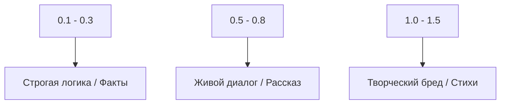

# 💬 Туториал 4: Секреты общения с моделью

> **Инференс — это искусство настройки параметров, превращающее случайные числа в глубокие мысли.**

---

## ⚙️ 1. Настройка параметров (Тюнинг)

Представьте, что параметры генерации — это "ручки" на пульте управления настроением нейросети.

### 🌡️ Temperature (Хаос)

### 🎯 Top-P (Фильтр мусора)
Если установить `Top-P = 0.9`, модель отбросит 10% самых нелепых вариантов. Это как если бы вы запретили себе использовать слова, которые совсем не подходят по смыслу.

### 🚫 Repetition Penalty (Борьба с "заеданием")
*   **1.0:** Модель может начать повторять "да, да, да...".
*   **1.2:** Легкое подталкивание к разнообразию.
*   **2.0:** Жесткий запрет на повторы. (Рекомендуется для базовых моделей v5).

---

## ✍️ 2. Искусство промптинга (Prompt Engineering)

Помните: ваша модель — это **"продолжатель текста"**, а не "исполнитель команд" (если вы не проводили специальное Instruction-обучение).

### 🚀 Базовая тактика: Контекстное начало
Вместо того чтобы просить модель что-то сделать, начните делать это за неё.

| Подход | Промпт (Ввод пользователя) | Почему это работает? |
| :--- | :--- | :--- |
| **❌ Приказ** | "Напиши стихотворение о весне." | Модель может начать рассуждать о поэзии. |
| **✅ Начало** | "Тихо капает капель, на дворе стоит апрель," | Вы задали ритм, рифму и тему. Модель обязана продолжить. |

---

### 📚 Продвинутые техники

#### 1. Few-Shot Prompting (Метод примеров)
Это самый мощный способ заставить базовую модель соблюдать формат. Дайте ей 2-3 примера того, что вы хотите.

> **Промпт:**
> "Фрукт: Яблоко | Цвет: Красный  
> Фрукт: Лимон | Цвет: Желтый  
> Фрукт: Виноград | Цвет:"  
> **Ответ модели:** "Фиолетовый" (или зеленый).

#### 2. Roleplay (Установка роли)
Задайте "личность" через описание ситуации.

> **Промпт:**  
> "Диалог между старым петербургским профессором и молодым студентом в 19 веке.  
> Профессор: Позвольте узнать, сударь, читали ли вы последний труд господина Достоевского?  
> Студент:"  
> **Ответ модели:** "Признаться честно, глубокоуважаемый Иван Иванович, руки всё не доходят..."

#### 3. Chain of Thought (Цепочка рассуждений)
Для логических задач заставьте модель "думать вслух".

> **Промпт:**  
> "Задача: У Пети было 3 яблока, он отдал 1.  
> Решение: Сначала у Пети было 3. Он отдал 1. Значит, осталось 3 - 1 = 2.  
> Ответ: 2.  
>   
> Задача: У Кати было 5 конфет, она съела 2.  
> Решение:"  

#### 4. Задание формата (JSON/Списки)
Базовые модели отлично справляются со списками, если вы начнете список.

> **Промпт:**  
> "Список покупок для борща:  
> 1. Свекла  
> 2. Капуста  
> 3."  

---

## ⚡ 3. Speculative Decoding: Скорость света

Если ваша модель была обучена с параметром `use_speculative=True`, в чате вы увидите невероятную скорость.

**Как это работает наглядно:**
1.  Маленькая голова "угадывает" следующие 3 токена: `[на, зеленой, траве]`.
2.  Большая модель проверяет их за **один проход**.
3.  Если угадано верно — вы получили 4 токена по цене одного!

---

## 🛡️ 4. Траблшутинг ответов

| Симптом | Причина | Что делать? |
| :--- | :--- | :--- |
| **Модель обрывает фразу** | Слишком мал `max_new_tokens`. | Увеличьте лимит токенов в чате. |
| **Текст превращается в кашу** | Слишком высокая `Temperature`. | Снизьте до 0.5. |
| **Бесконечные повторы** | Низкий `Repetition Penalty`. | Поставьте 1.5 - 2.0. |
| **Модель отвечает на другом языке**| Плохой датасет / "Загрязнение".| Проверьте чистоту обучающих данных. |

---

## 🎓 Заключение

Tolstoy AI Studio — это мощный инструмент. Теперь, когда вы знаете, как собрать данные, обучить модель и настроить её голос, вы готовы к созданию собственной уникальной нейросети.

> **Экспериментируйте. Ошибайтесь. Обучайте снова. В этом и заключается магия AI.**

*[⬆ Наверх к списку туториалов](../../README.md#🎓-обучающие-туториалы-tutorials)*
